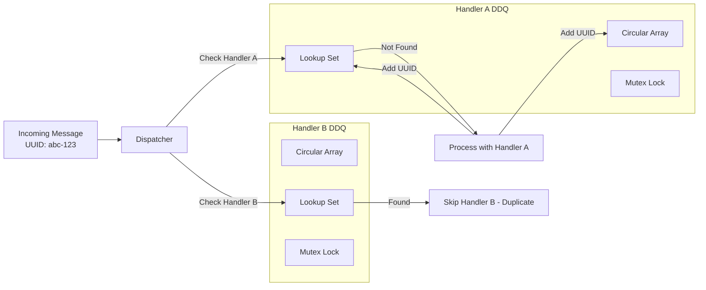
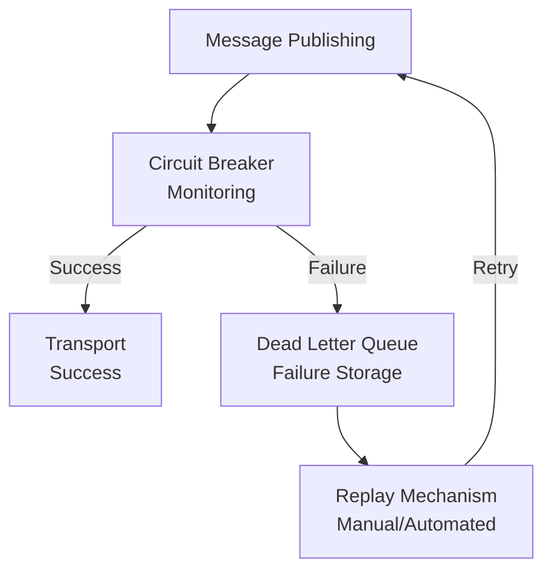

# SmartMessage Architecture

SmartMessage follows a plugin-based architecture that cleanly separates message concerns from transport and serialization mechanisms.

## Design Philosophy

SmartMessage is designed around the principle that **messages should be independent of their delivery mechanism**. Just as ActiveRecord abstracts database operations from business logic, SmartMessage abstracts message delivery from message content.

### Core Principles

1. **Separation of Concerns**: Message content, transport, and serialization are independent
2. **Plugin Architecture**: Pluggable transports and serializers
3. **Dual Configuration**: Both class-level and instance-level configuration
4. **Thread Safety**: Concurrent message processing with thread pools
5. **Gateway Support**: Messages can flow between different transports/serializers

## Architecture Overview

```mermaid
graph TB
    subgraph "SmartMessage Core"
        Base[SmartMessage::Base]
        Header[Message Header<br/>• UUID<br/>• Timestamps<br/>• Addressing]
        Props[Message Properties<br/>• Business Data<br/>• Validation<br/>• Versioning]
    end
    
    subgraph "Plugin System"
        Transport[Transport Plugin<br/>• publish()<br/>• subscribe()<br/>• Memory/Redis/STDOUT]
        Serializer[Serializer Plugin<br/>• encode()<br/>• decode()<br/>• JSON/Custom]
        Logger[Logger Plugin<br/>• Structured logging<br/>• Multiple outputs<br/>• Colorization]
    end
    
    subgraph "Message Processing"
        Dispatcher[Dispatcher<br/>• Route messages<br/>• Thread pool<br/>• Subscriptions<br/>• DDQ management]
        DDQ[Deduplication Queue<br/>• Handler-scoped<br/>• Memory/Redis storage<br/>• O(1) performance<br/>• Circular buffer]
        Handlers[Message Handlers<br/>• Default handler<br/>• Block handlers<br/>• Proc handlers<br/>• Method handlers]
    end
    
    subgraph "Reliability Layer"
        CircuitBreaker[Circuit Breaker<br/>• Failure thresholds<br/>• Automatic fallback<br/>• Recovery detection]
        DLQ[Dead Letter Queue<br/>• Failed messages<br/>• Replay mechanism<br/>• JSON Lines format]
    end
    
    subgraph "Monitoring"
        Stats[Statistics<br/>• Message counts<br/>• Processing metrics<br/>• Thread pool status]
        Filters[Message Filtering<br/>• Entity-aware routing<br/>• Regex patterns<br/>• Broadcast handling]
    end
    
    Base --> Header
    Base --> Props
    Base --> Transport
    Base --> Serializer
    Base --> Logger
    
    Transport --> Dispatcher
    Dispatcher --> DDQ
    Dispatcher --> Handlers
    Dispatcher --> Stats
    Dispatcher --> Filters
    
    Transport --> CircuitBreaker
    CircuitBreaker --> DLQ
    
    DDQ -.-> Stats
    Handlers -.-> Stats
```

## Core Components

### 1. SmartMessage::Base

The foundation class that all messages inherit from, built on `Hashie::Dash`.

**Key Responsibilities:**
- Property management and validation
- Plugin configuration (transport, serializer, logger)
- Message lifecycle management
- Header generation and management

**Location:** `lib/smart_message/base.rb:11-278`

```ruby
class MyMessage < SmartMessage::Base
  description "Handles custom message processing for my application"
  
  property :data
  
  config do
    transport MyTransport.new
    serializer MySerializer.new
  end
end
```

### 2. Transport Layer

Handles message delivery and routing between systems.

**Key Responsibilities:**
- Message publishing and receiving
- Subscription management
- Connection handling
- Transport-specific configuration

**Location:** `lib/smart_message/transport/`

```ruby
# Transport interface
class CustomTransport < SmartMessage::Transport::Base
  def publish(message_header, message_payload)
    # Send message via your transport
  end
  
  def subscribe(message_class, process_method)
    # Set up subscription
  end
end
```

### 3. Serializer System

Handles encoding and decoding of message content.

**Key Responsibilities:**
- Message encoding (Ruby object → wire format)
- Message decoding (wire format → Ruby object)
- Format-specific handling

**Location:** `lib/smart_message/serializer/`

```ruby
class CustomSerializer < SmartMessage::Serializer::Base
  def encode(message_instance)
    # Convert to wire format
  end
  
  def decode(payload)
    # Convert from wire format
  end
end
```

### 4. Dispatcher

Routes incoming messages to appropriate handlers using concurrent processing with integrated deduplication.

**Key Responsibilities:**
- Message routing based on class
- Thread pool management  
- Subscription catalog management
- Handler-scoped DDQ management
- Message filtering and statistics collection

**Location:** `lib/smart_message/dispatcher.rb`

```ruby
dispatcher = SmartMessage::Dispatcher.new
dispatcher.add("MyMessage", "MyMessage.process")
dispatcher.route(header, payload)

# DDQ integration is automatic when enabled
MyMessage.enable_deduplication!
```

### 5. Deduplication Queue (DDQ)

Handler-scoped message deduplication system preventing duplicate processing.

**Key Responsibilities:**
- UUID-based duplicate detection
- Handler isolation (each handler gets own DDQ)
- Memory and Redis storage backends
- O(1) performance with hybrid Array + Set data structure

**Architecture:**


**Location:** `lib/smart_message/deduplication.rb`, `lib/smart_message/ddq/`

### 6. Message Headers

Standard metadata attached to every message with entity addressing support.

**Key Responsibilities:**
- Message identification (UUID)
- Routing information (message class, version)
- Tracking data (timestamps, process IDs)
- Entity addressing (from, to, reply_to)

**Location:** `lib/smart_message/header.rb`

```ruby
header = message._sm_header
puts header.uuid          # "550e8400-e29b-41d4-a716-446655440000"
puts header.message_class # "MyMessage"
puts header.published_at  # 2025-08-17 10:30:00 UTC
puts header.from          # "payment-service"
puts header.to            # "order-service"
puts header.version       # 1
```

## Message Lifecycle

### 1. Definition Phase
```ruby
class OrderMessage < SmartMessage::Base
  property :order_id
  property :amount
  
  config do
    transport SmartMessage::Transport.create(:memory)
    serializer SmartMessage::Serializer::JSON.new
  end
end
```

### 2. Subscription Phase
```ruby
# Basic subscription
OrderMessage.subscribe

# Subscription with filtering
OrderMessage.subscribe(from: /^payment-.*/, to: 'order-service')
OrderMessage.subscribe('PaymentService.process', broadcast: true)

# Each subscription gets its own DDQ automatically
# DDQ Key: "OrderMessage:OrderMessage.process"
# DDQ Key: "OrderMessage:PaymentService.process"
```

### 3. Publishing Phase
```ruby
order = OrderMessage.new(order_id: "123", amount: 99.99)
order.from("order-service").to("payment-service")
order.publish
# 1. Creates header with UUID, timestamp, addressing
# 2. Encodes message via serializer  
# 3. Sends via transport
# 4. Circuit breaker monitors for failures
```

### 4. Receiving Phase
```ruby
# Transport receives message
transport.receive(header, payload)
# 1. Routes to dispatcher
# 2. Dispatcher checks DDQ for duplicates per handler
# 3. Applies message filters (from/to/broadcast)
# 4. Spawns thread for processing matching handlers
# 5. Marks UUID as processed in handler's DDQ
```

### 5. Message Handler Processing

SmartMessage supports multiple handler types, routed through the dispatcher:

```ruby
# Default handler (self.process method)
def self.process(message_header, message_payload)
  data = JSON.parse(message_payload)
  order = new(data)
  fulfill_order(order)
end

# Block handler (inline processing)
OrderMessage.subscribe do |header, payload|
  data = JSON.parse(payload)
  quick_processing(data)
end

# Proc handler (reusable across message types)
audit_proc = proc do |header, payload|
  AuditService.log_message(header.message_class, payload)
end
OrderMessage.subscribe(audit_proc)

# Method handler (service class processing)
class OrderService
  def self.process_order(header, payload)
    data = JSON.parse(payload)
    complex_business_logic(data)
  end
end
OrderMessage.subscribe("OrderService.process_order")
```

**Handler Routing Process:**
1. Dispatcher receives message and header
2. Looks up all registered handlers for message class
3. For each handler:
   - **String handlers**: Resolves to class method via constantize
   - **Proc handlers**: Calls proc directly from registry
4. Executes handlers in parallel threads
5. Collects statistics and handles errors

## Plugin System Architecture

### Dual-Level Configuration

SmartMessage supports configuration at both class and instance levels:

```ruby
# Class-level (default for all instances)
class PaymentMessage < SmartMessage::Base
  config do
    transport ProductionTransport.new
    serializer SecureSerializer.new
  end
end

# Instance-level (overrides class configuration)
test_payment = PaymentMessage.new(amount: 1.00)
test_payment.config do
  transport TestTransport.new  # Override for this instance
end
```

This enables sophisticated gateway patterns where messages can be:
- Received from one transport (e.g., RabbitMQ)
- Processed with business logic
- Republished to another transport (e.g., Kafka)

### Plugin Registration

Transports are registered in a central registry:

```ruby
# Register custom transport
SmartMessage::Transport.register(:redis, RedisTransport)

# Use registered transport
MyMessage.config do
  transport SmartMessage::Transport.create(:redis, url: "redis://localhost")
end
```

## Thread Safety & Concurrency

### Thread Pool Management

The dispatcher uses `Concurrent::CachedThreadPool` for processing:

```ruby
# Each message processing happens in its own thread
@router_pool.post do
  # Message processing happens here
  target_class.constantize.process(header, payload)
end
```

### Thread Safety Considerations

1. **Message Instances**: Each message is processed in isolation
2. **Shared State**: Avoid shared mutable state in message classes
3. **Statistics**: Thread-safe statistics collection via `SimpleStats`
4. **Graceful Shutdown**: Automatic cleanup on process exit

### Monitoring Thread Pools

```ruby
dispatcher = SmartMessage::Dispatcher.new
status = dispatcher.status

puts "Running: #{status[:running]}"
puts "Queue length: #{status[:queue_length]}"
puts "Completed tasks: #{status[:completed_task_count]}"
```

## Error Handling Architecture

### Exception Isolation

Processing exceptions are isolated to prevent cascade failures:

```ruby
begin
  target_class.constantize.process(header, payload)
rescue Exception => e
  # Log error but don't crash the dispatcher
  # TODO: Add proper exception logging
end
```

### Custom Error Types

SmartMessage defines specific error types for different failure modes:

```ruby
module SmartMessage::Errors
  class TransportNotConfigured < RuntimeError; end
  class SerializerNotConfigured < RuntimeError; end
  class NotImplemented < RuntimeError; end
  class ReceivedMessageNotSubscribed < RuntimeError; end
  class UnknownMessageClass < RuntimeError; end
end
```

## Reliability & Fault Tolerance

### Circuit Breaker Integration

SmartMessage integrates BreakerMachines for production-grade reliability:

```ruby
# Transport operations protected by circuit breakers
class MyTransport < SmartMessage::Transport::Base
  circuit :transport_publish do
    threshold failures: 5, within: 30.seconds
    reset_after 15.seconds
    fallback SmartMessage::CircuitBreaker::Fallbacks.dead_letter_queue
  end
end
```

**Circuit Breaker States:**
- **Closed**: Normal operation, requests pass through
- **Open**: Threshold exceeded, requests fail fast
- **Half-Open**: Testing if service recovered

### Dead Letter Queue

Failed messages are automatically captured in the Dead Letter Queue:

```ruby
# Automatic capture when circuit breaker trips
message.publish  # If transport fails, goes to DLQ

# Manual capture for business logic failures
dlq = SmartMessage::DeadLetterQueue.default
dlq.enqueue(header, payload, error: "Validation failed")
```

**DLQ Architecture:**



**DLQ Features:**
- JSON Lines format for efficient append operations
- FIFO queue operations with thread safety
- Replay capabilities with transport override
- Administrative tools for filtering and analysis

## Statistics & Monitoring

### Built-in Statistics

SmartMessage automatically collects processing statistics including DDQ metrics:

```ruby
# Statistics are collected for:
SS.add(message_class, 'publish')
SS.add(message_class, process_method, 'routed')

# Access statistics
puts SS.stat
puts SS.get("MyMessage", "publish")

# DDQ-specific statistics
stats = OrderMessage.ddq_stats
puts "DDQ utilization: #{stats[:utilization]}%"
puts "Current count: #{stats[:current_count]}"
```

### Monitoring Points

1. **Message Publishing**: Count of published messages per class
2. **Message Routing**: Count of routed messages per processor
3. **Thread Pool**: Queue length, completed tasks, running status
4. **Transport Status**: Connection status, message counts
5. **DDQ Metrics**: Utilization, duplicate detection rates, memory usage
6. **Message Filtering**: Filter match rates, entity-aware routing statistics

## Configuration Architecture

### Configuration Hierarchy

1. **Class-level defaults**: Set via `MyMessage.config`
2. **Instance-level overrides**: Set via `message.config`
3. **Runtime configuration**: Dynamic plugin switching

### Configuration Objects

Configuration uses method-based DSL:

```ruby
config do
  transport MyTransport.new(option1: value1)
  serializer MySerializer.new(option2: value2)
  logger MyLogger.new(level: :debug)
end
```

### Plugin Resolution

When a message needs a plugin:

1. Check instance-level configuration
2. Fall back to class-level configuration
3. Raise error if not configured

```ruby
def transport
  @transport || @@transport || raise(Errors::TransportNotConfigured)
end
```

This architecture provides flexibility while maintaining clear fallback behavior.