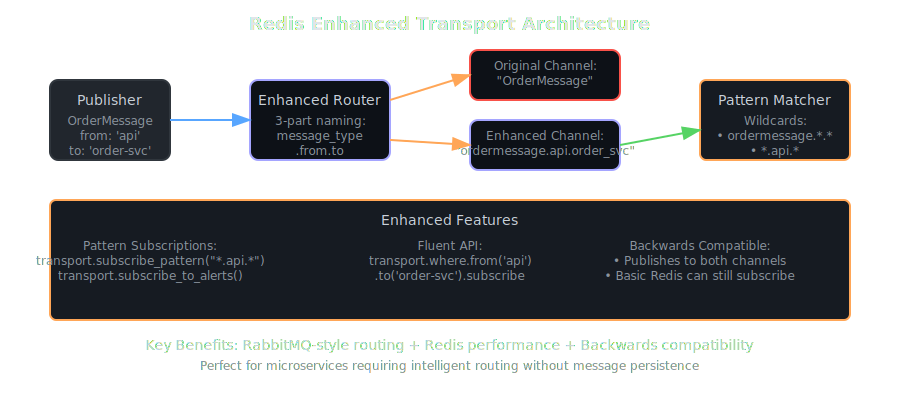

# Redis Enhanced Transport

The **Redis Enhanced Transport** extends the basic Redis transport with RabbitMQ-style pattern matching and intelligent routing capabilities. It provides sophisticated message routing while maintaining full backwards compatibility with the basic Redis transport.

## Overview

Redis Enhanced Transport is perfect for:
- **Microservices architecture** - Sophisticated routing between services
- **Pattern-based routing** - RabbitMQ-style patterns without RabbitMQ
- **Legacy compatibility** - Gradual migration from basic Redis transport
- **Development flexibility** - Advanced routing for complex applications

## Key Features

- 🎯 **Pattern-Based Subscriptions** - Wildcard support (`*` patterns)
- 🔄 **Dual Channel Publishing** - Backwards compatibility with basic transport
- 🛠️ **Fluent API** - Chainable subscription building
- 📡 **Enhanced Routing** - 3-part channel names: `message_type.from.to`
- 🚀 **High Performance** - ~1.2ms latency, 75K+ messages/second
- 🔌 **Drop-in Replacement** - Seamless upgrade from basic Redis transport

## Architecture



The Enhanced Transport uses a sophisticated 3-part channel naming scheme and publishes to both original and enhanced channels for backward compatibility.

## Channel Format

Enhanced channels use a structured naming scheme:
```
message_type.from.to
```

**Examples**:
- `ordermessage.api_gateway.order_service`
- `paymentmessage.payment_service.bank_gateway` 
- `alertmessage.monitoring.admin_panel`

## Pattern Matching


### Wildcard Support
- **`*`** - Matches exactly one segment
- **Pattern Examples**:
  - `ordermessage.*.*` - All order messages
  - `*.payment_gateway.*` - All messages from payment gateway
  - `alertmessage.*.*` - All alert messages

## Fluent API


Build complex subscription patterns with chainable methods:

```ruby
# Basic patterns
transport.where.from('api-gateway').subscribe         # *.api-gateway.*
transport.where.to('order-service').subscribe         # *.*.order-service
transport.where.type('OrderMessage').subscribe        # ordermessage.*.*

# Combined patterns
transport.where.from('api').to('service').subscribe   # *.api.service
transport.where.type('Alert').from('monitoring').subscribe  # alert.monitoring.*
```

## Configuration

### Basic Setup

```ruby
# Minimal configuration
transport = SmartMessage::Transport::RedisEnhancedTransport.new

# With options
transport = SmartMessage::Transport::RedisEnhancedTransport.new(
  url: 'redis://localhost:6379',
  db: 0,
  auto_subscribe: true,
  reconnect_attempts: 5,
  reconnect_delay: 1
)
```

### Using with SmartMessage

```ruby
# Configure as default transport
SmartMessage.configure do |config|
  config.default_transport = SmartMessage::Transport::RedisEnhancedTransport.new
end

# Enhanced message with routing
class OrderMessage < SmartMessage::Base
  property :order_id, required: true
  property :customer_id, required: true
  
  # Set source and destination for routing
  from 'api-gateway'
  to 'order-service'
  
  transport :redis_enhanced
  
  def process
    puts "Processing order #{order_id} from #{_sm_header.from} to #{_sm_header.to}"
  end
end
```

## Configuration Options

Inherits all options from Redis Transport:

| Option | Type | Default | Description |
|--------|------|---------|-------------|
| `url` | String | `redis://localhost:6379` | Redis connection URL |
| `db` | Integer | `0` | Redis database number |
| `auto_subscribe` | Boolean | `true` | Automatically start subscriber |
| `reconnect_attempts` | Integer | `5` | Connection retry attempts |
| `reconnect_delay` | Integer | `1` | Seconds between retries |

## Usage Examples

### Basic Pattern Subscriptions

```ruby
# Subscribe to all order messages
OrderMessage.subscribe_pattern('ordermessage.*.*')

# Subscribe to messages from specific service
transport.subscribe_from_sender('payment-gateway')

# Subscribe to messages for specific service  
transport.subscribe_to_recipient('order-service')

# Subscribe to all messages of a type
transport.subscribe_to_type('AlertMessage')
```

### Fluent API Examples

```ruby
# Service-specific routing
transport.where
  .from('web-app')
  .to('user-service')
  .subscribe

# Message type filtering
transport.where
  .type('AnalyticsEvent')
  .from('web-app')
  .subscribe

# Complex routing conditions
transport.where
  .from('monitoring')
  .to('admin-panel')
  .type('AdminAlert')
  .subscribe
```

### Microservices Communication


```ruby
# API Gateway → Service routing
class UserRequest < SmartMessage::Base
  property :user_id, required: true
  property :action, required: true
  
  from 'api-gateway'
  to 'user-service'
  
  def process
    puts "User #{user_id} action: #{action}"
  end
end

# Service → Database routing  
class UserQuery < SmartMessage::Base
  property :query, required: true
  
  from 'user-service'
  to 'database'
  
  def process
    puts "Executing query: #{query}"
  end
end

# Subscribe to service-specific messages
transport.where.to('user-service').subscribe    # All messages to user service
transport.where.from('api-gateway').subscribe   # All messages from API gateway
```

### Convenience Methods

```ruby
# Subscribe to broadcasts
transport.subscribe_to_broadcasts  # *.*.broadcast

# Subscribe to alerts from any service
transport.subscribe_to_alerts      # alertmessage.*.*, *alert*.*.*

# Subscribe to specific recipient
transport.subscribe_to_recipient('payment-service')  # *.*.payment-service

# Subscribe to specific sender
transport.subscribe_from_sender('monitoring')        # *.monitoring.*

# Subscribe to message type
transport.subscribe_to_type('OrderMessage')          # ordermessage.*.*
```

## Dual Publishing


Enhanced Transport maintains backwards compatibility by publishing to both channel formats:

### Publishing Behavior
```ruby
# When OrderMessage publishes:
OrderMessage.new(order_id: 'ORD-001').publish

# Results in publications to BOTH:
# 1. "OrderMessage" (basic format - for compatibility)
# 2. "ordermessage.api_gateway.order_service" (enhanced format)
```

### Subscriber Compatibility
- **Basic Redis subscribers** → Receive from original channel
- **Enhanced Redis subscribers** → Receive from enhanced channel  
- **Both can coexist** → Gradual migration possible

## Advanced Routing Patterns

### Environment-Based Routing

```ruby
# Development services
transport.where.to(/^(dev|staging)-.*/).subscribe

# Production services  
transport.where.to(/^prod-.*/).subscribe

# Cross-environment alerts
transport.where
  .type('Alert')
  .from(/^(prod|staging)-.*/)
  .to('monitoring')
  .subscribe
```

### Service Pattern Routing

```ruby
# All payment-related services
transport.where.from(/^payment-.*/).subscribe

# API layer to service layer
transport.where
  .from(/^(web|mobile|api)-.*/)
  .to(/^.*-service$/)
  .subscribe

# Monitoring aggregation
transport.where
  .type('MetricMessage')
  .to('monitoring')
  .subscribe
```

### Message Filtering

```ruby
class AlertMessage < SmartMessage::Base
  property :level, required: true
  property :message, required: true
  
  from 'monitoring'
  
  def process
    puts "[#{level.upcase}] #{message}"
  end
end

# Subscribe only to critical alerts
AlertMessage.subscribe(from: 'monitoring') do |message|
  message.level == 'critical'
end

# Subscribe to alerts from specific services
AlertMessage.subscribe(from: /^(database|api)-.*/)
```

## Performance Characteristics

- **Latency**: ~1.2ms average (slightly higher due to pattern processing)
- **Throughput**: 75,000+ messages/second  
- **Memory per Subscriber**: ~2MB (pattern storage overhead)
- **Concurrent Subscribers**: ~250 practical limit
- **Pattern Processing**: Minimal CPU overhead
- **Backwards Compatibility**: No performance penalty

## API Reference

### Pattern Subscription Methods

#### `#subscribe_pattern(pattern)`
Subscribe to messages matching a specific pattern.

```ruby
transport.subscribe_pattern('ordermessage.*.*')
transport.subscribe_pattern('*.payment.*')
```

#### `#where`
Returns a fluent API builder for complex subscriptions.

```ruby
builder = transport.where
builder.from('api').to('service').type('Order').subscribe
```

#### Convenience Methods

```ruby
transport.subscribe_to_recipient('service-name')      # *.*.service-name  
transport.subscribe_from_sender('service-name')       # *.service-name.*
transport.subscribe_to_type('MessageType')            # messagetype.*.*
transport.subscribe_to_alerts                         # Alert patterns
transport.subscribe_to_broadcasts                     # *.*.broadcast
```

### Fluent API Builder Methods

#### `#from(service_name)`
Filter messages from specific service(s).

```ruby
transport.where.from('api-gateway')           # String match
transport.where.from(/^api-.*/)              # Regex match
transport.where.from(['api', 'web'])         # Array match
```

#### `#to(service_name)`
Filter messages to specific service(s).

```ruby
transport.where.to('order-service')          # String match
transport.where.to(/^.*-service$/)          # Regex match  
transport.where.to(['user-svc', 'order-svc']) # Array match
```

#### `#type(message_type)`
Filter by message type.

```ruby
transport.where.type('OrderMessage')         # String match
transport.where.type(/^.*Alert$/)           # Regex match
```

#### `#subscribe(&block)`
Execute the subscription with optional filtering block.

```ruby
transport.where.from('api').subscribe do |message|
  message.priority == 'high'  # Additional filtering
end
```

## Migration from Basic Transport

### Step 1: Enable Enhanced Transport
```ruby
# Before (Basic Redis)
SmartMessage.configure do |config|
  config.default_transport = SmartMessage::Transport::RedisTransport.new
end

# After (Enhanced Redis)
SmartMessage.configure do |config|
  config.default_transport = SmartMessage::Transport::RedisEnhancedTransport.new
end
```

### Step 2: Gradual Pattern Adoption
```ruby
# Existing subscriptions continue to work
OrderMessage.subscribe  # Still works exactly the same

# New subscriptions can use patterns
OrderMessage.subscribe_pattern('ordermessage.api.*')  # New capability
```

### Step 3: Enhanced Message Design
```ruby
# Enhanced messages with routing info
class NewOrderMessage < SmartMessage::Base
  property :order_id, required: true
  
  from 'api-gateway'
  to 'order-service'
  
  # Inherits enhanced capabilities automatically
end
```

## Best Practices

### Pattern Design
- Use consistent service naming conventions
- Keep patterns as specific as possible for performance
- Document routing patterns for team understanding

### Service Communication
- Use meaningful service names in routing
- Implement service discovery patterns
- Monitor cross-service message flows

### Backwards Compatibility
- Test migration thoroughly in staging
- Monitor both channel formats during transition
- Maintain basic transport compatibility during migration

### Performance Optimization
- Limit wildcard usage for high-throughput scenarios
- Use specific patterns rather than broad wildcards
- Monitor Redis memory usage with pattern storage

## Use Cases

### Microservices Architecture
Perfect for complex service topologies requiring intelligent routing.

### Legacy System Migration
Gradual migration from basic Redis transport without breaking existing functionality.

### Development Environments
Flexible routing for rapidly changing service architectures.

### Pattern-Based Routing
Applications requiring RabbitMQ-style routing without RabbitMQ complexity.

## Related Documentation

- [Enhanced Transport Examples](https://github.com/madbomber/smart_message/tree/main/examples/redis_enhanced) - Complete working examples
- [Redis Transport Comparison](redis-transport-comparison.md) - Compare all Redis transports  
- [Redis Queue Transport](redis-queue-transport.md) - Persistent queues with load balancing
- [Transport Overview](../reference/transports.md) - All available transports

## Examples

The `examples/redis_enhanced/` directory contains comprehensive examples demonstrating Redis Enhanced Transport capabilities:

### Advanced Routing Patterns
- **[enhanced_01_basic_patterns.rb](https://github.com/MadBomber/smart_message/blob/main/examples/redis_enhanced/enhanced_01_basic_patterns.rb)** - Foundation patterns for enhanced routing
  - Simple subscriber patterns with wildcards
  - Basic pattern matching and subscription filtering
  - Enhanced routing setup and configuration

- **[enhanced_02_fluent_api.rb](https://github.com/MadBomber/smart_message/blob/main/examples/redis_enhanced/enhanced_02_fluent_api.rb)** - Fluent API usage examples
  - Chain-based subscription configuration
  - Dynamic pattern building and modification
  - Fluent interface for complex routing scenarios

- **[enhanced_03_dual_publishing.rb](https://github.com/MadBomber/smart_message/blob/main/examples/redis_enhanced/enhanced_03_dual_publishing.rb)** - Dual publishing strategies
  - Broadcasting to multiple patterns simultaneously
  - Pattern-specific message customization
  - Load balancing across pattern-matched subscribers

- **[enhanced_04_advanced_routing.rb](https://github.com/MadBomber/smart_message/blob/main/examples/redis_enhanced/enhanced_04_advanced_routing.rb)** - Complex routing scenarios
  - Multi-level pattern hierarchies
  - Conditional routing based on message content
  - Dynamic subscriber management and pattern updates

### Key Features Demonstrated

The enhanced examples showcase unique Redis Enhanced Transport capabilities:
- **Pattern-Based Subscriptions** - Wildcard and regex pattern matching
- **Advanced Channel Routing** - Beyond simple class-name channels
- **Fluent Configuration API** - Chainable subscription setup
- **Dynamic Routing** - Runtime pattern modification
- **Complex Message Filtering** - Content-based routing decisions

### Running Examples

```bash
# Prerequisites: Start Redis server
redis-server

# Navigate to the SmartMessage directory
cd smart_message

# Run enhanced transport examples
ruby examples/redis_enhanced/enhanced_01_basic_patterns.rb
ruby examples/redis_enhanced/enhanced_02_fluent_api.rb
ruby examples/redis_enhanced/enhanced_04_advanced_routing.rb

# Monitor pattern-based routing
redis-cli PSUBSCRIBE "*"
```

### Example Patterns

The enhanced examples demonstrate these routing patterns:
- **Service patterns**: `user.*`, `order.*`, `payment.*`
- **Environment patterns**: `*.dev`, `*.staging`, `*.prod`
- **Priority patterns**: `urgent.*`, `normal.*`, `low.*`
- **Geographic patterns**: `*.us-east`, `*.eu-west`, `*.asia`

### Advanced Features

The enhanced transport examples also show:
- **Backward compatibility** with standard Redis Transport
- **Performance optimizations** for pattern-heavy workloads
- **Error handling** for pattern mismatch scenarios
- **Testing strategies** for pattern-based routing

Each example builds on the previous ones, showing progressively more sophisticated routing capabilities that make Redis Enhanced Transport ideal for complex, distributed messaging architectures.