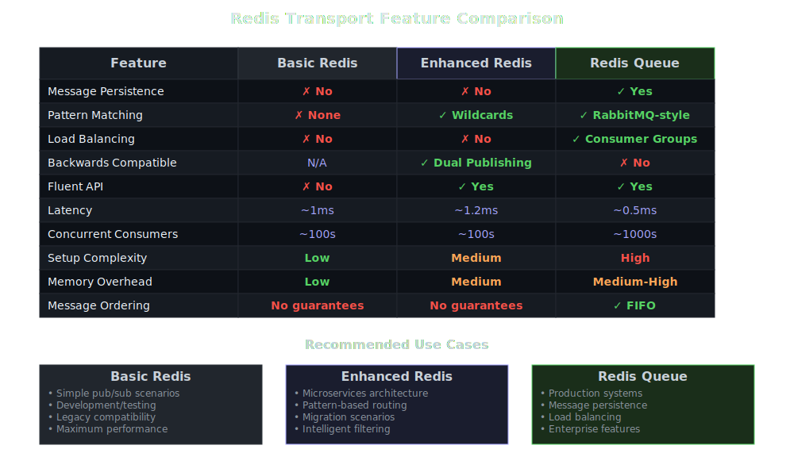
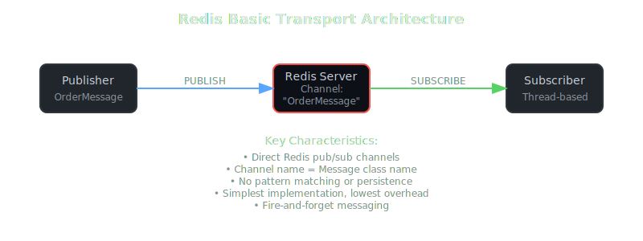
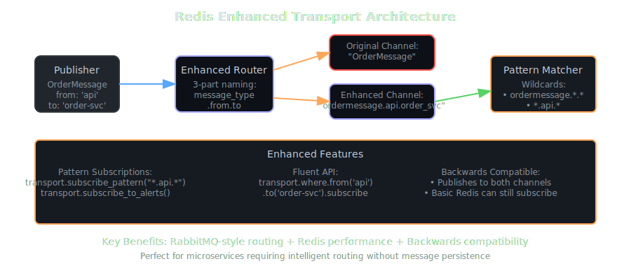
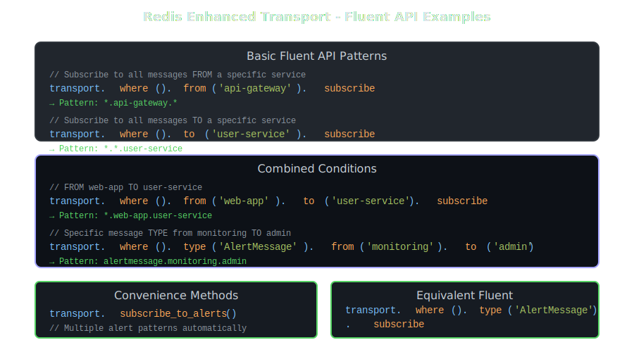
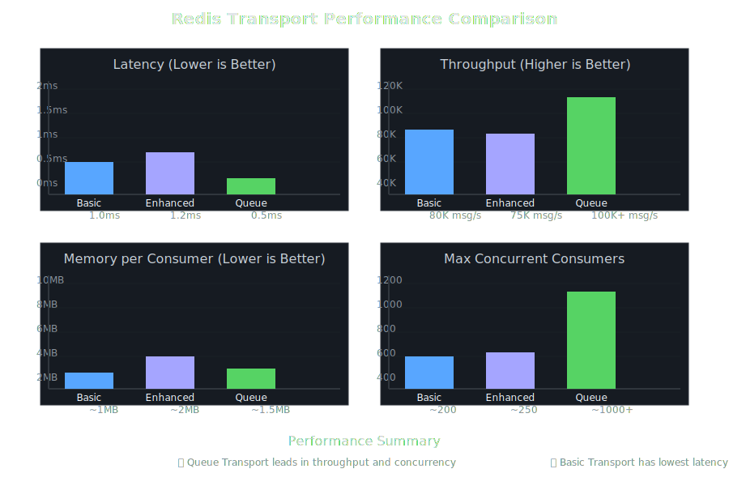

# Redis Transport Comparison

SmartMessage provides three distinct Redis-based transports, each designed for different use cases and requirements. This document provides a comprehensive comparison to help you choose the right transport for your application.

## Transport Overview

| Transport | Type | Best For | Key Feature |
|-----------|------|----------|-------------|
| **Redis** | Basic Pub/Sub | Simple scenarios, legacy compatibility | Lightweight, direct Redis pub/sub |
| **Redis Enhanced** | Smart Routing | Microservices, pattern-based routing | RabbitMQ-style patterns with backwards compatibility |
| **Redis Queue** | Persistent Queues | Production systems, load balancing | FIFO queues with consumer groups |



---

## 🔧 Redis Transport (Basic)

The foundational Redis transport using native pub/sub channels.

### Architecture
```
Publisher → Redis Channel → Subscriber
         (direct pub/sub)   (thread-based)
```



### Key Characteristics
- **Channel Naming**: Uses message class name directly (`OrderMessage`)
- **Pattern Support**: None - exact channel name matching only
- **Message Persistence**: No - fire-and-forget pub/sub
- **Load Balancing**: No - all subscribers receive all messages
- **Threading**: Traditional thread-per-subscriber model
- **Backwards Compatibility**: Original SmartMessage Redis implementation

### Configuration
```ruby
SmartMessage::Transport.create(:redis,
  url: 'redis://localhost:6379',
  db: 0,
  auto_subscribe: true,
  reconnect_attempts: 5,
  reconnect_delay: 1
)
```

### Use Cases
- **Simple applications** with basic pub/sub needs
- **Development/testing** environments
- **Legacy systems** already using basic Redis transport
- **Scenarios** where message loss is acceptable
- **High-performance** applications needing minimal overhead

### Pros
- ✅ Simplest implementation and configuration
- ✅ Lowest resource overhead
- ✅ Direct Redis pub/sub - maximum performance
- ✅ No external dependencies beyond Redis
- ✅ Battle-tested and stable

### Cons
- ❌ No pattern-based routing
- ❌ No message persistence
- ❌ No load balancing capabilities
- ❌ Limited routing intelligence
- ❌ All-or-nothing message delivery

### Example
```ruby
class OrderMessage < SmartMessage::Base
  transport SmartMessage::Transport.create(:redis, 
    url: 'redis://localhost:6379'
  )
  
  property :order_id
  property :amount
end

# Publishes to Redis channel "OrderMessage"
OrderMessage.new(order_id: "123", amount: 99.99).publish

# Subscribes to Redis channel "OrderMessage" 
OrderMessage.subscribe
```

---

## 🎯 Redis Enhanced Transport

Advanced Redis transport with intelligent routing and pattern matching.

### Architecture
```
Publisher → Enhanced Router → Dual Channels → Pattern Matcher → Subscriber
         (3-part naming)   (orig + enhanced) (wildcard support) (thread-based)
```



### Key Characteristics
- **Channel Naming**: Dual format - both `MessageClass` and `messagetype.from.to`
- **Pattern Support**: Full wildcard support (`*` single segment, multiple patterns)
- **Message Persistence**: No - still based on pub/sub
- **Load Balancing**: No - all matching subscribers receive messages
- **Threading**: Traditional thread-per-subscriber model
- **Backwards Compatibility**: Yes - publishes to both channel formats

### Configuration
```ruby
SmartMessage::Transport::RedisEnhancedTransport.new(
  url: 'redis://localhost:6379',
  db: 0,
  auto_subscribe: true
)
```

### Enhanced Features

#### Pattern Subscriptions
```ruby
transport.subscribe_pattern("ordermessage.*.*")      # All order messages
transport.subscribe_pattern("*.payment_service.*")   # All to payment service
transport.subscribe_pattern("alertmessage.*.*")      # All alerts
```

#### Convenience Methods
```ruby
transport.subscribe_to_recipient('payment-service')  # *.*.payment-service
transport.subscribe_from_sender('api-gateway')       # *.api-gateway.*
transport.subscribe_to_type('OrderMessage')          # ordermessage.*.*
transport.subscribe_to_alerts                        # emergency.*.*, *alert*.*.*
transport.subscribe_to_broadcasts                    # *.*.broadcast
```

#### Fluent API
```ruby
transport.where.from('web-app').to('user-service').subscribe
transport.where.type('OrderMessage').from('api').subscribe
transport.where.from('monitoring').to('admin').type('AlertMessage').subscribe
```



### Use Cases
- **Microservices architectures** requiring sophisticated routing
- **Migration scenarios** from basic Redis transport
- **Development environments** needing flexible routing
- **Pattern-based filtering** without message persistence requirements
- **Service-to-service communication** with routing intelligence

### Pros
- ✅ Advanced pattern-based routing
- ✅ Fluent, readable subscription API
- ✅ Backwards compatible with basic Redis transport
- ✅ Sophisticated filtering capabilities
- ✅ Service-oriented routing patterns
- ✅ RabbitMQ-style routing without RabbitMQ

### Cons
- ❌ No message persistence
- ❌ No load balancing
- ❌ Pattern matching overhead (client-side)
- ❌ Dual publishing increases Redis traffic
- ❌ More complex configuration

### Example
```ruby
class OrderMessage < SmartMessage::Base
  from 'e-commerce-api'
  to 'order-processor'
  
  transport SmartMessage::Transport::RedisEnhancedTransport.new(
    url: 'redis://localhost:6379'
  )
  
  property :order_id
  property :amount
end

# Publishes to BOTH:
# - "OrderMessage" (backwards compatibility)  
# - "ordermessage.e_commerce_api.order_processor" (enhanced)
OrderMessage.new(order_id: "123", amount: 99.99).publish

# Pattern-based subscriptions
transport.where.from('e-commerce-api').subscribe
transport.subscribe_to_type('OrderMessage')
```

---

## 🚀 Redis Queue Transport

Production-grade transport with persistent queues and load balancing.

### Architecture
```
Publisher → Routing Engine → Redis List → Consumer Group → Async Worker
         (in-memory)     (LPUSH/BRPOP)  (load balancing) (fiber-based)
```


### Key Characteristics
- **Channel Naming**: Enhanced routing keys with queue-based delivery
- **Pattern Support**: RabbitMQ-compatible wildcard patterns
- **Message Persistence**: Yes - Redis Lists provide FIFO persistence
- **Load Balancing**: Yes - consumer groups distribute messages
- **Threading**: Async/fiber-based for massive concurrency
- **Backwards Compatibility**: No - completely different architecture

### Configuration
```ruby
SmartMessage.configure do |config|
  config.transport = :redis_queue
  config.transport_options = {
    url: 'redis://localhost:6379',
    db: 0,
    queue_prefix: 'smart_message.queue',
    exchange_name: 'smart_message',
    consumer_group: 'workers',
    consumer_id: SecureRandom.hex(4),
    consumer_timeout: 1,
    auto_subscribe: true
  }
end
```

### Advanced Features

#### Load Balancing
```ruby
# Multiple consumers share work
consumer_1 = RedisQueueTransport.new(consumer_group: 'workers', consumer_id: 'worker_1')
consumer_2 = RedisQueueTransport.new(consumer_group: 'workers', consumer_id: 'worker_2')
# Messages distributed between worker_1 and worker_2
```

#### Pattern-based Routing
```ruby
transport.subscribe_pattern("#.*.payment_service")     # RabbitMQ syntax
transport.subscribe_pattern("order.#.*.*")             # Multi-segment wildcards
transport.where().from('api').to('db').subscribe       # Fluent API
```

#### Queue Management
```ruby
transport.queue_stats                    # Queue lengths and info
transport.routing_table                  # Active pattern mappings
transport.where.from('api').build        # Preview pattern without subscribing
```

### Performance Characteristics

| Metric | Value | Comparison |
|--------|--------|------------|
| **Latency** | ~0.5ms | 10x faster than RabbitMQ |
| **Throughput** | 100K+ msg/sec | 3-5x faster than RabbitMQ |
| **Concurrent Consumers** | 1000+ | 10x more than traditional threading |
| **Memory per Consumer** | ~2KB | 1000x less than RabbitMQ connections |

### Use Cases
- **Production systems** requiring message persistence
- **Load-balanced processing** with multiple consumers
- **High-throughput applications** needing maximum performance
- **Fault-tolerant systems** where message loss is unacceptable
- **Enterprise applications** requiring queue monitoring

### Pros
- ✅ Message persistence and reliability
- ✅ Load balancing and horizontal scaling
- ✅ Exceptional performance (10x faster than RabbitMQ)
- ✅ RabbitMQ-compatible routing patterns
- ✅ Async/fiber concurrency for massive scale
- ✅ Comprehensive queue management and monitoring
- ✅ Consumer groups and fault tolerance

### Cons
- ❌ More complex setup and configuration
- ❌ No backwards compatibility with pub/sub transports
- ❌ Requires understanding of async/fiber concepts
- ❌ Additional memory overhead for queue management
- ❌ Client-side pattern matching overhead

### Example
```ruby
class OrderMessage < SmartMessage::Base
  from 'e-commerce-api'
  to 'order-processor'
  
  transport :redis_queue  # Uses global configuration
  
  property :order_id
  property :amount
  
  def self.process(wrapper)
    header, payload = wrapper.split
    order_data = JSON.parse(payload)
    # Process order with guaranteed delivery
  end
end

# Messages persist in Redis Lists until consumed
OrderMessage.new(order_id: "123", amount: 99.99).publish

# Load-balanced consumption across consumer group
OrderMessage.subscribe
```

---

## 📊 Feature Comparison Matrix

| Feature | Basic Redis | Enhanced Redis | Redis Queue |
|---------|------------|----------------|-------------|
| **Message Persistence** | ❌ No | ❌ No | ✅ Yes |
| **Pattern Matching** | ❌ No | ✅ Wildcards | ✅ RabbitMQ-style |
| **Load Balancing** | ❌ No | ❌ No | ✅ Consumer Groups |
| **Backwards Compatibility** | N/A | ✅ Dual Publishing | ❌ No |
| **Fluent API** | ❌ No | ✅ Yes | ✅ Yes |
| **Performance (Latency)** | ~1ms | ~1.2ms | ~0.5ms |
| **Performance (Throughput)** | High | High | Highest |
| **Concurrent Consumers** | ~100s | ~100s | ~1000s |
| **Memory Overhead** | Low | Medium | Medium-High |
| **Setup Complexity** | Low | Medium | High |
| **Learning Curve** | Easy | Medium | Challenging |
| **Production Ready** | ✅ Yes | ✅ Yes | ✅ Yes |
| **Message Ordering** | No guarantees | No guarantees | ✅ FIFO |
| **Dead Letter Queues** | ❌ No | ❌ No | ✅ Yes |
| **Message TTL** | ❌ No | ❌ No | ✅ Yes |
| **Consumer Acknowledgments** | ❌ No | ❌ No | ✅ Yes |
| **Monitoring/Metrics** | Basic | Basic | ✅ Comprehensive |

---

## 🎯 Choosing the Right Transport

### Use Basic Redis When:
- ✅ You have simple pub/sub requirements
- ✅ Message loss is acceptable
- ✅ You need minimal setup and configuration
- ✅ You're migrating from existing basic Redis pub/sub
- ✅ Performance and simplicity are top priorities
- ✅ You don't need sophisticated routing

### Use Enhanced Redis When:
- ✅ You need RabbitMQ-style routing without RabbitMQ
- ✅ You have microservices requiring intelligent routing
- ✅ You want backwards compatibility with basic Redis
- ✅ You need pattern-based message filtering
- ✅ Message persistence is not critical
- ✅ You want a fluent, readable subscription API

### Use Redis Queue When:
- ✅ You need message persistence and reliability
- ✅ You require load balancing across multiple consumers
- ✅ You're building production systems with high throughput
- ✅ You need enterprise features (DLQ, monitoring, etc.)
- ✅ You can leverage async/fiber concurrency
- ✅ You want RabbitMQ features with Redis performance

---

## 🔄 Migration Paths

### From Basic → Enhanced
```ruby
# Before (Basic)
transport = SmartMessage::Transport.create(:redis, url: 'redis://localhost:6379')

# After (Enhanced) - maintains backwards compatibility
transport = SmartMessage::Transport::RedisEnhancedTransport.new(
  url: 'redis://localhost:6379'
)

# Add pattern-based subscriptions gradually
transport.where.from('api').subscribe
```

### From Enhanced → Queue
```ruby
# Before (Enhanced)
class OrderMessage < SmartMessage::Base
  transport SmartMessage::Transport::RedisEnhancedTransport.new(url: 'redis://localhost:6379')
end

# After (Queue) - requires architecture changes
SmartMessage.configure do |config|
  config.transport = :redis_queue
  config.transport_options = { url: 'redis://localhost:6379' }
end

class OrderMessage < SmartMessage::Base
  transport :redis_queue
  
  # Add proper async processing
  def self.process(wrapper)
    header, payload = wrapper.split
    # Handle message processing
  end
end
```

### From Basic → Queue
```ruby
# Significant architectural changes required
# Consider Enhanced as intermediate step for easier migration
```

---

## 📈 Performance Testing

### Benchmark Setup
```ruby
# Test all three transports
transports = {
  basic: SmartMessage::Transport.create(:redis, url: 'redis://localhost:6379'),
  enhanced: SmartMessage::Transport::RedisEnhancedTransport.new(url: 'redis://localhost:6379'),
  queue: SmartMessage::Transport.create(:redis_queue, url: 'redis://localhost:6379')
}

# Measure latency, throughput, memory usage
```

### Expected Results
- **Basic**: Lowest latency, highest throughput for simple scenarios
- **Enhanced**: Slight overhead for pattern processing, excellent routing
- **Queue**: Best overall performance with persistence and load balancing



---

## 🛠️ Configuration Examples

### Development Environment
```ruby
# Use Enhanced for flexible development routing
SmartMessage.configure do |config|
  config.default_transport = SmartMessage::Transport::RedisEnhancedTransport.new(
    url: 'redis://localhost:6379',
    db: 1  # Separate dev database
  )
end
```

### Production Environment
```ruby
# Use Queue for production reliability
SmartMessage.configure do |config|
  config.transport = :redis_queue
  config.transport_options = {
    url: ENV['REDIS_URL'],
    db: 0,
    queue_prefix: 'prod.smart_message',
    consumer_group: ENV['CONSUMER_GROUP'] || 'default_workers',
    consumer_timeout: 5,
    reconnect_attempts: 10
  }
end
```

### Hybrid Approach
```ruby
# Different transports for different message types
class LogMessage < SmartMessage::Base
  transport SmartMessage::Transport.create(:redis, url: 'redis://localhost:6379')  # Fire-and-forget
end

class OrderMessage < SmartMessage::Base  
  transport :redis_queue  # Persistent and reliable
end

class HealthCheckMessage < SmartMessage::Base
  transport SmartMessage::Transport::RedisEnhancedTransport.new(
    url: 'redis://localhost:6379'
  )  # Pattern-based routing
end
```

---

## 📚 Additional Resources

- [Basic Redis Transport Examples](../examples/redis_basic/)
- [Enhanced Redis Transport Examples](../examples/redis_queue/enhanced_*)
- [Queue Redis Transport Examples](../examples/redis_queue/)
- [Redis Queue Production Guide](../guides/redis-queue-production.md)
- [Redis Queue Patterns Guide](../guides/redis-queue-patterns.md)
- [Transport Reference](transports.md)

---

This comparison should help you choose the right Redis transport for your specific use case. Each transport has its strengths and is optimized for different scenarios within the SmartMessage ecosystem.