# SmartMessage City Emergency Services Demo

This comprehensive demo showcases a complete city emergency services communication system built with SmartMessage. It demonstrates real-world scenarios including emergency response coordination, health monitoring, and AI-powered incident reporting.

## 🏙️ City Scenario Overview

The demo simulates a city emergency services network with multiple independent services that communicate through a Redis pub/sub messaging system. Each service operates autonomously but coordinates with others through standardized message protocols.

### 🏢 City Services

| Service | Program File | Purpose | Key Features |
|---------|-------------|---------|--------------|
| **Emergency Dispatch Center** | `emergency_dispatch_center.rb` | 911 call routing and coordination | Call triage, department dispatch, call tracking |
| **Citizen** | `citizen.rb` | 911 emergency call simulation | Realistic emergency scenarios, automatic/manual calling |
| **Fire Department** | `fire_department.rb` | Fire emergency response coordination | Fire engine dispatch, equipment deployment |
| **Police Department** | `police_department.rb` | Law enforcement and security response | Unit assignment, crime response, alarm handling |
| **Local Bank** | `local_bank.rb` | Banking security monitoring | Silent alarm system, robbery detection |
| **Residential House** | `house.rb` | Fire safety monitoring | Smoke detection, resident safety alerts |
| **Health Department** | `health_department.rb` | City services health monitoring | Service status tracking, COVID-19 protocols |
| **Smart Visitor** | `visitor.rb` | AI-powered incident reporting | Emergency report generation, message selection |
| **Redis Monitor** | `redis_monitor.rb` | Real-time message monitoring | Live message traffic visualization |
| **Redis Stats** | `redis_stats.rb` | Performance analytics dashboard | Pub/sub statistics, throughput analysis |

## 📨 Message Types

The city uses 8 standardized message types for emergency communication:

### Emergency Messages
- **📞 Emergency911Message** - Citizen calls to 911 dispatch center
- **🔥 FireEmergencyMessage** - Fire alerts from houses or 911 to Fire Department
- **🚨 SilentAlarmMessage** - Security breaches from banks to Police Department
- **👮 PoliceDispatchMessage** - Police unit coordination responses
- **🚒 FireDispatchMessage** - Fire suppression deployment responses

### System Messages
- **✅ EmergencyResolvedMessage** - Incident closure notifications
- **💚 HealthCheckMessage** - Service availability monitoring (every 5 seconds)
- **📊 HealthStatusMessage** - Service condition responses

## 🔄 System Architecture

### Health Monitoring System
All city services implement a **countdown timer health system** that:
- Resets on each HealthCheckMessage received (10-second timeout)
- Triggers COVID-19 shutdown if no health check received
- Responds with HealthStatusMessage (green/yellow/red status)
- Replaces traditional circuit breaker patterns

### AI-Powered Incident Reporting
The Visitor service uses RubyLLM for intelligent incident reporting:
- Dynamically discovers available message types
- AI selects appropriate message format for incidents
- AI generates realistic property values
- Comprehensive logging of AI interactions

## 📊 Message Flow Diagrams

### 1. 911 Emergency Call Flow

```mermaid
sequenceDiagram
    participant C as 👤 Citizen
    participant EDC as 📞 Emergency Dispatch (911)
    participant FD as 🚒 Fire Department
    participant PD as 👮 Police Department
    
    C->>EDC: Emergency911Message
    Note over C,EDC: Citizen reports emergency<br/>Type: fire, medical, crime, etc.<br/>Severity: critical/high/medium/low
    
    EDC->>EDC: Analyze call & determine dispatch
    
    alt Fire/Medical/Rescue/Hazmat Emergency
        EDC->>FD: FireEmergencyMessage (if fire)
        EDC->>FD: Emergency911Message (if medical/rescue)
        FD->>EDC: FireDispatchMessage
    end
    
    alt Crime/Security/Accident Emergency  
        EDC->>PD: Emergency911Message
        PD->>EDC: PoliceDispatchMessage
    end
    
    Note over EDC: Call tracking & statistics
```


### 2. Fire Emergency Flow

```mermaid
sequenceDiagram
    participant H as 🏠 House
    participant FD as 🚒 Fire Department
    participant All as 📢 All Services
    
    H->>FD: FireEmergencyMessage
    Note over H,FD: Smoke detected<br/>Fire type: electrical/grease/general<br/>Severity: critical/high/medium
    
    FD->>FD: Assess fire severity
    FD->>FD: Dispatch equipment
    Note over FD: Engine-1, Ladder-1<br/>Rescue-1, Hazmat-1
    
    FD->>All: FireDispatchMessage
    Note over All: Equipment dispatched<br/>ETA: 3-8 minutes
    
    FD->>All: EmergencyResolvedMessage
    Note over All: Fire suppressed<br/>Scene secure
```


### 3. Security Emergency Flow

```mermaid
sequenceDiagram
    participant B as 🏦 Bank
    participant PD as 👮 Police Department
    participant All as 📢 All Services
    
    B->>PD: SilentAlarmMessage
    Note over B,PD: Robbery detected<br/>Alarm type: break_in/robbery<br/>Threat level: high/critical
    
    PD->>PD: Assess threat level
    PD->>PD: Assign units
    Note over PD: Unit-101, Unit-102<br/>Detective-1, SWAT-Alpha
    
    PD->>All: PoliceDispatchMessage
    Note over All: Units dispatched<br/>Priority: emergency/critical
    
    PD->>All: EmergencyResolvedMessage
    Note over All: Suspects apprehended<br/>Scene secure
```


### 4. AI Visitor Intelligence Flow

```mermaid
sequenceDiagram
    participant V as 🧑‍💼 Visitor (AI)
    participant AI as 🤖 RubyLLM
    participant ES as 🚨 Emergency Services
    
    V->>V: Witness incident
    V->>AI: Analyze available message types
    Note over V,AI: Dynamic message discovery<br/>Property analysis
    
    AI->>V: Select appropriate message type
    Note over AI: SilentAlarmMessage for robbery<br/>FireEmergencyMessage for fire
    
    V->>AI: Generate realistic properties
    Note over V,AI: Bank names, locations<br/>Fire types, severities
    
    V->>ES: Publish selected message
    Note over ES: Emergency services respond<br/>based on message type
```


### Health Monitoring System


```mermaid
sequenceDiagram
    participant HD as 🏥 Health Department
    participant FD as 🚒 Fire Department
    participant PD as 👮 Police Department
    participant LB as 🏦 Local Bank
    participant H as 🏠 House
    
    Note over HD: Every 5 seconds
    HD->>+FD: HealthCheckMessage
    HD->>+PD: HealthCheckMessage
    HD->>+LB: HealthCheckMessage
    HD->>+H: HealthCheckMessage
    
    FD-->>HD: HealthStatusMessage (Green/Yellow/Red)
    PD-->>HD: HealthStatusMessage (Green/Yellow/Red)
    LB-->>HD: HealthStatusMessage (Green/Yellow/Red)
    H-->>HD: HealthStatusMessage (Green/Yellow/Red)
    
    Note over FD,H: 10-second countdown timer
    Note over FD,H: Resets on each HealthCheck
    Note over FD,H: COVID-19 shutdown if timeout
```

### 5. Service Internal Architecture

```mermaid
graph TB
    subgraph "📞 Emergency Dispatch Center (911)"
        EDC1[911 Call Listener] --> EDC2[Call Analysis Engine]
        EDC2 --> EDC3[Department Router]
        EDC3 --> EDC4[Fire Dispatcher]
        EDC3 --> EDC5[Police Dispatcher]
        EDC2 --> EDC6[Call Tracking]
        EDC6 --> EDC7[Statistics Engine]
    end
    
    subgraph "👤 Citizen"
        C1[Emergency Scenarios] --> C2[Random Selection]
        C2 --> C3[911 Call Generator]
        C3 --> C4[Message Publisher]
        C5[Interactive Mode] --> C2
        C6[Automatic Mode] --> C2
    end
    
    subgraph "🧑‍💼 Smart Visitor (AI-Powered)"
        V1[Incident Observer] --> V2[AI Message Analyzer]
        V2 --> V3[RubyLLM Integration]
        V3 --> V4[Message Generator]
        V4 --> V5[Emergency Publisher]
        
        V21[Message Discovery] --> V22[Property Analysis]
        V22 --> V23[AI Content Generation]
    end
```


## 🚀 Getting Started

### Prerequisites
- **macOS** (required for start_demo.sh/stop_demo.sh scripts)
- **iTerm2** terminal emulator (for automated demo startup)
- Ruby 2.7 or higher
- Redis server
- RubyLLM gem with AI provider credentials (OpenAI, Anthropic, etc.)
- SmartMessage gem

### Installation
```bash
# Install iTerm2 (macOS only)
brew install --cask iterm2

# Install Redis
brew install redis
brew services start redis

# Install dependencies
bundle install

# Set up AI credentials (optional - fallback logic available)
export OPENAI_API_KEY="your-key-here"
export ANTHROPIC_API_KEY="your-key-here"
```

### Quick Start (macOS + iTerm2)
```bash
# Make scripts executable
chmod +x start_demo.sh stop_demo.sh

# Start all services in iTerm2 (macOS only)
./start_demo.sh

# Stop all services and close iTerm2 window (macOS only)
./stop_demo.sh
```

### Manual Start (Cross-Platform)
For non-macOS systems or when not using iTerm2:
```bash
# Terminal 1 - Health monitoring
ruby health_department.rb

# Terminal 2 - Emergency dispatch center (911)
ruby emergency_dispatch_center.rb

# Terminal 3 - Emergency services
ruby fire_department.rb

# Terminal 4 - Law enforcement
ruby police_department.rb

# Terminal 5 - Banking security
ruby local_bank.rb

# Terminal 6 - Residential monitoring
ruby house.rb

# Terminal 7 - Citizen 911 caller (optional)
ruby citizen.rb

# Terminal 8 - AI visitor (optional)
ruby visitor.rb

# Terminal 9 - Message monitoring (optional)
ruby redis_monitor.rb

# Terminal 10 - Performance analytics (optional)
ruby redis_stats.rb
```

## 🎭 Demo Scenarios

### 📞 911 Emergency Call Scenario
1. **Citizen witnesses emergency** → Generates Emergency911Message with random scenario
2. **911 Dispatch Center receives call** → Analyzes emergency type and severity
3. **Call routing** → Dispatches to appropriate departments (Fire/Police)
4. **Department response** → Services respond with dispatch messages
5. **Call tracking** → Statistics maintained until resolution

### 🔥 Fire Emergency Scenario
1. **House detects smoke** → Publishes FireEmergencyMessage
2. **Fire Department responds** → Analyzes severity, dispatches equipment
3. **Incident resolution** → Publishes EmergencyResolvedMessage

### 🚨 Security Emergency Scenario
1. **Bank detects robbery** → Publishes SilentAlarmMessage
2. **Police Department responds** → Assigns units, coordinates response
3. **Incident resolved** → Publishes EmergencyResolvedMessage

### 🤖 AI-Powered Visitor Reporting
1. **Visitor witnesses incident** → Analyzes available message types
2. **AI selects appropriate message** → SilentAlarmMessage for robbery
3. **AI generates properties** → Realistic bank name, location, details
4. **Message published** → Emergency services receive report

### 💚 Health Monitoring Scenario
1. **Health Department broadcasts** → HealthCheckMessage every 5 seconds
2. **All services respond** → HealthStatusMessage with current status
3. **Timeout handling** → Services shut down after 10 seconds without health check

## 📋 Service Details

### Emergency Dispatch Center (`emergency_dispatch_center.rb`)
```ruby
# 911 emergency call coordination hub
- Subscribes to: Emergency911Message (to: '911')
- Publishes: FireEmergencyMessage, Emergency911Message (routed)
- Call analysis: Determines which departments to dispatch
- Call tracking: Maintains active call registry with timestamps
- Statistics: Tracks calls by type and department dispatches
- Routing rules: Fire/Medical → Fire Dept, Crime/Security → Police
```

### Citizen (`citizen.rb`)
```ruby
# 911 emergency call simulation system
- Publishes: Emergency911Message (to: '911')
- Emergency scenarios: 15+ realistic emergency types
- Types: fire, medical, crime, accident, hazmat, rescue, other
- Modes: Interactive (press Enter) or Automatic (15-30 sec intervals)
- Realistic data: Random caller names, phone numbers, locations
- Severity levels: critical, high, medium, low
```

### Fire Department (`fire_department.rb`)
```ruby
# Handles fire emergencies with equipment dispatch
- Subscribes to: FireEmergencyMessage, Emergency911Message, HealthCheckMessage
- Publishes: FireDispatchMessage, HealthStatusMessage, EmergencyResolvedMessage
- Equipment: Engine-1, Ladder-1, Rescue-1, Hazmat-1
- Response time: 3-8 minutes based on severity
```

### Police Department (`police_department.rb`)
```ruby
# Coordinates law enforcement response
- Subscribes to: SilentAlarmMessage, Emergency911Message, HealthCheckMessage
- Publishes: PoliceDispatchMessage, HealthStatusMessage, EmergencyResolvedMessage
- Units: Unit-101, Unit-102, Unit-103, Detective-1, SWAT-Alpha
- Priority levels: routine, urgent, emergency, critical
```

### Smart Visitor (`visitor.rb`)
```ruby
# AI-powered incident reporting system
- Dynamic message type discovery
- RubyLLM integration for intelligent selection
- Comprehensive AI interaction logging
- Fallback logic when AI unavailable
- Realistic data generation
```

### Redis Monitor (`redis_monitor.rb`)
```ruby
# Real-time message traffic visualization
- Subscribes to: All Redis channels (wildcard pattern)
- Live message stream display with color coding
- Message type-specific payload formatting
- Timestamp and routing information
- Emergency/health message categorization
```

### Redis Stats (`redis_stats.rb`)
```ruby
# Comprehensive performance analytics dashboard
- Real-time pub/sub statistics
- Message throughput analysis (messages/sec)
- Channel activity monitoring
- Command performance metrics
- Interactive controls (q=quit, r=refresh, +/-=rate)
- Terminal-optimized full-screen display
```

## 🛠️ Configuration

### Health Monitoring
```ruby
# Customize health check interval (default: 5 seconds)
HEALTH_CHECK_INTERVAL = 5

# Customize service timeout (default: 10 seconds)
SERVICE_TIMEOUT = 10
```

### AI Configuration
```ruby
# Configure RubyLLM providers
RubyLLM.configure do |config|
  config.openai_api_key = ENV['OPENAI_API_KEY']
  config.anthropic_api_key = ENV['ANTHROPIC_API_KEY']
  config.log_level = :info
end
```

### Redis Transport
```ruby
# Customize Redis connection
SmartMessage.configure do |config|
  config.transport = SmartMessage::Transport::RedisTransport.new(
    host: 'localhost',
    port: 6379,
    db: 0
  )
end
```

## 📊 Monitoring and Observability

### Real-Time Monitoring Tools

#### 🔍 Redis Monitor (`redis_monitor.rb`)
Live message stream monitoring with formatted output:

```bash
ruby redis_monitor.rb
```

**Features:**
- **Color-coded messages** by type (Health=Green, Emergency=Red, Dispatch=Blue)
- **Formatted payload display** showing relevant details for each message type
- **Real-time streaming** of all Redis pub/sub traffic
- **Message routing info** (from/to fields, timestamps)
- **Emergency context** (fire severity, police units, health status)

**Example Output:**
```
🔍 SmartMessage Redis Monitor
   Monitoring Redis pub/sub traffic...

[14:35:22] Messages::SilentAlarmMessage
   📤 From: local-bank
   📥 To: police-department
   🚨 First National Bank - robbery (high)
   📍 123 Main Street

[14:35:23] Messages::PoliceDispatchMessage  
   📤 From: police-department
   📥 To: broadcast
   🚔 Units: Unit-101, Unit-102
   📍 Location: 123 Main Street
   ⏱️ ETA: 3 minutes
```

#### 📈 Redis Stats (`redis_stats.rb`)
Interactive performance analytics dashboard:

```bash
ruby redis_stats.rb
```

**Features:**
- **Full-screen terminal dashboard** with real-time updates
- **Pub/Sub statistics** (subscribers, channels, message rates)
- **Channel analytics** (top channels by volume, rates per channel)
- **Command performance** (Redis command statistics and latency)
- **Session tracking** (messages since start, peak rates)
- **Interactive controls** (keyboard shortcuts for navigation)

**Dashboard Sections:**
1. **Pub/Sub Overview** - Total messages, active channels, rates
2. **Channel Analytics** - Per-channel message counts and rates
3. **Command Statistics** - Redis command performance metrics
4. **Latency Metrics** - Response time analysis
5. **System Health** - Memory usage, connected clients

**Keyboard Controls:**
- `q` / `Q` / `Esc` - Quit monitor
- `r` / `R` - Force refresh
- `+` - Increase refresh rate  
- `-` - Decrease refresh rate
- `h` / `H` / `?` - Show help overlay

### Service Logs
Each service maintains detailed logs:
- `health_department.log` - Health monitoring activities
- `fire_department.log` - Fire response coordination
- `police_department.log` - Law enforcement activities
- `visitor.log` - AI interaction details

### Message Tracing
All messages include comprehensive headers:
```json
{
  "_sm_header": {
    "uuid": "unique-message-id",
    "message_class": "Messages::FireEmergencyMessage",
    "published_at": "2025-08-22T04:29:27-05:00",
    "publisher_pid": 12345,
    "version": 1,
    "from": "house-sensor-01",
    "serializer": "SmartMessage::Serializer::Json"
  },
  "_sm_payload": {
    "location": "123 Oak Street",
    "fire_type": "electrical",
    "severity": "high"
  }
}
```

## 🔧 Development and Extensions

### Adding New Services
1. Create service class inheriting from appropriate base
2. Implement health monitoring with countdown timer
3. Define message subscriptions and handlers
4. Add service to demo startup scripts

### Custom Message Types
1. Create message class in `messages/` directory
2. Define properties with validation
3. Add descriptions for AI discovery
4. Implement handlers in relevant services

### AI Enhancement
1. Customize prompts in `visitor.rb`
2. Add new incident types
3. Enhance property generation logic
4. Implement multi-step AI workflows

## 🚨 Emergency Procedures

### Service Recovery
If a service becomes unresponsive:
```bash
# Check service status
ps aux | grep ruby

# Use monitoring tools to diagnose issues
ruby redis_monitor.rb  # Watch live message flow
ruby redis_stats.rb    # Check performance metrics

# Restart specific service
ruby fire_department.rb

# Full system restart (macOS with iTerm2)
./stop_demo.sh && ./start_demo.sh
```

### Health System Reset
```bash
# Reset all service health timers
redis-cli FLUSHDB

# Monitor health recovery in real-time
ruby redis_monitor.rb &  # Background monitoring
ruby health_department.rb
```

### Troubleshooting with Monitoring Tools

#### Message Flow Issues
```bash
# Watch live message traffic to identify bottlenecks
ruby redis_monitor.rb

# Look for missing message types or routing problems
# Check if health checks are flowing properly
# Verify emergency messages reach appropriate services
```

#### Performance Analysis  
```bash
# Launch interactive performance dashboard
ruby redis_stats.rb

# Monitor for:
# - High message rates that might overwhelm services
# - Channel imbalances (some channels too busy/idle)
# - Redis command performance issues
# - Memory usage spikes
```

#### Platform-Specific Issues

**macOS with iTerm2:**
```bash
# If start_demo.sh fails to open iTerm2
# Ensure iTerm2 is installed and in Applications folder
brew install --cask iterm2

# If demo window doesn't close properly
./stop_demo.sh
# Or manually: pkill -f "ruby.*\.rb"
```

**Cross-Platform Manual Start:**
```bash
# If automated scripts don't work on your platform
# Use manual start approach with individual terminals
# All programs work on any Ruby-supported platform
```

## 📈 Performance Metrics

The demo tracks various performance metrics:
- Message throughput (messages/second)
- Response times (service-to-service)
- AI processing times
- Health check compliance rates
- Emergency response coordination times

## 🎯 Real-World Applications

This demo architecture demonstrates patterns applicable to:
- **Emergency Services Coordination**
- **IoT Device Management**
- **Microservices Communication**
- **Event-Driven Architecture**
- **AI-Powered System Integration**
- **Health Monitoring Systems**

## 📚 Further Reading

- [SmartMessage Documentation](../README.md)
- [Message Filtering Guide](../../docs/message_filtering.md)
- [Transport Configuration](../../docs/transports.md)
- [AI Integration Patterns](../../docs/ai_integration.md)

## 🤝 Contributing

This demo welcomes contributions:
1. Fork the repository
2. Create feature branch
3. Add new services or scenarios
4. Test with existing city infrastructure
5. Submit pull request with detailed description

---

*The SmartMessage City Emergency Services Demo - Demonstrating real-world distributed system communication with AI-powered intelligence and comprehensive health monitoring.*