# Smart Home IoT Data Flow - Redis Pub/Sub Transport

This document describes the data flow architecture for the Smart Home IoT example using SmartMessage's Redis transport. The system demonstrates how multiple IoT devices communicate through Redis pub/sub channels with targeted message routing.

## System Architecture Overview

The smart home system consists of three types of IoT devices and a central dashboard, all communicating through Redis pub/sub channels. Each message type uses its own Redis channel for efficient routing and scaling.

```mermaid
graph TB
    %% IoT Devices
    THERM["🌡️ Smart Thermostat<br/>THERM-001<br/>Living Room"]
    CAM["📹 Security Camera<br/>CAM-001<br/>Front Door"]
    LOCK["🚪 Smart Door Lock<br/>LOCK-001<br/>Main Entrance"]
    DASH["📊 IoT Dashboard<br/>System Monitor"]

    %% Redis Channels
    subgraph REDIS ["Redis Pub/Sub Channels"]
        SENSOR["SensorDataMessage<br/>Temperature, Motion, Status<br/>Battery Levels"]
        COMMAND["DeviceCommandMessage<br/>set_temperature, start_recording<br/>lock/unlock, get_status"]
        ALERT["AlertMessage<br/>Motion Detected, Battery Low<br/>High Temperature"]
        STATUS["DashboardStatusMessage<br/>System Status, Device Counts<br/>Alert Summaries"]
    end

    %% Device Publishing
    THERM -.->|"Temperature Data"| SENSOR
    CAM -.->|"Motion Data"| SENSOR
    LOCK -.->|"Lock Status"| SENSOR
    CAM -.->|"Motion Alerts"| ALERT
    THERM -.->|"High Temp Alerts"| ALERT
    LOCK -.->|"Battery Low Alerts"| ALERT
    DASH -.->|"System Status"| STATUS
    DASH -.->|"Device Commands"| COMMAND

    %% Device Subscribing
    COMMAND -->|"set_temperature"| THERM
    COMMAND -->|"start/stop recording"| CAM
    COMMAND -->|"lock/unlock"| LOCK
    SENSOR -->|"All sensor data"| DASH
    COMMAND -->|"Command logging"| DASH
    ALERT -->|"All alerts"| DASH
    STATUS -->|"Status updates"| DASH

    %% Styling
    classDef deviceStyle fill:#ff6b6b,stroke:#c0392b,stroke-width:2px,color:#fff
    classDef cameraStyle fill:#4ecdc4,stroke:#16a085,stroke-width:2px,color:#fff
    classDef lockStyle fill:#ffe66d,stroke:#f39c12,stroke-width:2px,color:#333
    classDef dashStyle fill:#a8e6cf,stroke:#27ae60,stroke-width:2px,color:#333
    classDef redisStyle fill:#dc143c,stroke:#a00,stroke-width:2px,color:#fff

    class THERM deviceStyle
    class CAM cameraStyle
    class LOCK lockStyle
    class DASH dashStyle
    class SENSOR,COMMAND,ALERT,STATUS redisStyle
```



## Message Flow Details

### 1. Sensor Data Flow
All IoT devices continuously publish sensor readings to the `SensorDataMessage` Redis channel:

- **🌡️ Thermostat**: Temperature readings, battery level
- **📹 Camera**: Motion detection status, battery level  
- **🚪 Door Lock**: Lock/unlock status, battery level

**Example SensorDataMessage:**
```json
{
  "device_id": "THERM-001",
  "device_type": "thermostat", 
  "location": "living_room",
  "sensor_type": "temperature",
  "value": 22.5,
  "unit": "celsius",
  "timestamp": "2025-08-18T10:30:00Z",
  "battery_level": 85.2
}
```

### 2. Device Command Flow
The dashboard and external systems send commands to specific devices via the `DeviceCommandMessage` channel:

```mermaid
sequenceDiagram
    participant App as Mobile App
    participant Redis as Redis Channel
    participant Therm as Thermostat
    participant Cam as Camera
    participant Lock as Door Lock

    App->>Redis: DeviceCommandMessage<br/>device_id THERM-001 set_temperature
    Redis->>Therm: ✅ Processes THERM prefix match
    Redis->>Cam: ❌ Ignores not CAM prefix
    Redis->>Lock: ❌ Ignores not LOCK prefix
    
    App->>Redis: DeviceCommandMessage<br/>device_id CAM-001 start_recording
    Redis->>Therm: ❌ Ignores not THERM prefix
    Redis->>Cam: ✅ Processes CAM prefix match
    Redis->>Lock: ❌ Ignores not LOCK prefix
```



**Device Command Filtering Rules:**
- **THERM-*** devices: Accept `set_temperature`, `get_status`
- **CAM-*** devices: Accept `start_recording`, `stop_recording`, `get_status`
- **LOCK-*** devices: Accept `lock`, `unlock`, `get_status`

### 3. Alert System Flow
Devices publish critical notifications to the `AlertMessage` channel when conditions are detected:

```mermaid
flowchart LR
    subgraph Triggers
        T1[High Temperature > 28°C]
        T2[Motion Detected]
        T3[Battery < 20%]
        T4[Device Offline > 30s]
    end
    
    subgraph Devices
        THERM2[🌡️ Thermostat]
        CAM2[📹 Camera]
        LOCK2[🚪 Door Lock]
    end
    
    subgraph AlertChannel [AlertMessage Channel]
        A1[Motion Alert]
        A2[High Temp Alert]
        A3[Battery Low Alert]
        A4[Device Offline Alert]
    end
    
    T1 --> THERM2 --> A2
    T2 --> CAM2 --> A1
    T3 --> LOCK2 --> A3
    T4 --> A4
    
    AlertChannel --> DASH2[📊 Dashboard]
```



### 4. Dashboard Status Flow
The dashboard aggregates all system data and publishes periodic status updates:


## Channel-Based Architecture Benefits

### 1. **Efficient Message Routing**
Each message type uses its own Redis channel, preventing unnecessary message processing:

| Channel | Publishers | Subscribers | Purpose |
|---------|------------|-------------|---------|
| `SensorDataMessage` | All Devices | Dashboard | Real-time sensor readings |
| `DeviceCommandMessage` | Dashboard, Apps | All Devices | Device control commands |
| `AlertMessage` | All Devices | Dashboard | Critical notifications |
| `DashboardStatusMessage` | Dashboard | Dashboard, Apps | System status updates |

### 2. **Device-Specific Command Filtering**
Devices use prefix-based filtering to process only relevant commands:

```ruby
# Example: Thermostat command filtering
def self.handle_command(message_header, message_payload)
  command_data = JSON.parse(message_payload)
  
  # Only process commands for thermostats
  return unless command_data['device_id']&.start_with?('THERM-')
  return unless ['set_temperature', 'get_status'].include?(command_data['command'])
  
  # Process the command...
end
```

### 3. **Scalable Pub/Sub Pattern**
The architecture supports easy scaling:

- ✅ **Add new device types**: Just define new device ID prefixes
- ✅ **Add new message types**: Create new Redis channels as needed  
- ✅ **Multiple instances**: Each device can have multiple instances
- ✅ **Load balancing**: Redis handles distribution automatically

## Running the Example

To see this data flow in action:

```bash
# Ensure Redis is running
redis-server

# Run the IoT example
cd examples
ruby 04_redis_smart_home_iot.rb
```

**What you'll observe:**
1. **Device initialization** and Redis connection setup
2. **Sensor data publishing** every 3-5 seconds per device
3. **Command routing** with device-specific responses
4. **Alert generation** when motion is detected or conditions change
5. **Dashboard status updates** every 10 seconds showing active device counts

## Redis Channel Monitoring

You can monitor the Redis channels directly:

```bash
# View active channels
redis-cli PUBSUB CHANNELS

# Monitor all channel activity
redis-cli MONITOR

# Subscribe to specific channels
redis-cli SUBSCRIBE SensorDataMessage
redis-cli SUBSCRIBE DeviceCommandMessage
redis-cli SUBSCRIBE AlertMessage
redis-cli SUBSCRIBE DashboardStatusMessage
```

## Key Design Patterns Demonstrated

### 1. **Message Class as Channel Name**
SmartMessage automatically uses the message class name as the Redis channel name, providing clean separation.

### 2. **Device ID-Based Routing**
Commands are filtered by device ID prefixes, ensuring only intended devices process commands.

### 3. **Centralized Monitoring**
The dashboard subscribes to all channels, providing comprehensive system visibility.

### 4. **Event-Driven Alerts**
Devices autonomously generate alerts based on sensor readings and conditions.

### 5. **Graceful Degradation**
System falls back to memory transport if Redis is unavailable, ensuring development continues.

This architecture demonstrates production-ready IoT messaging patterns using Redis pub/sub for efficient, scalable device communication.