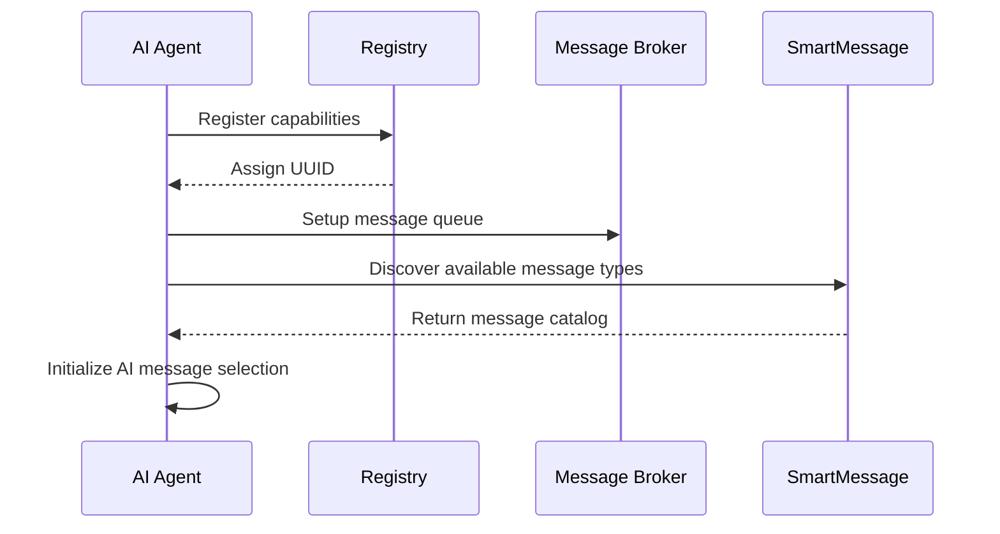
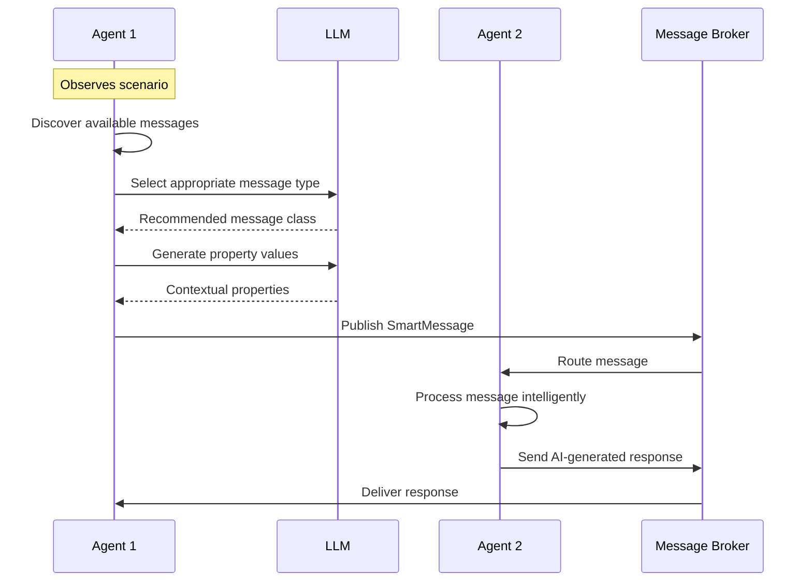
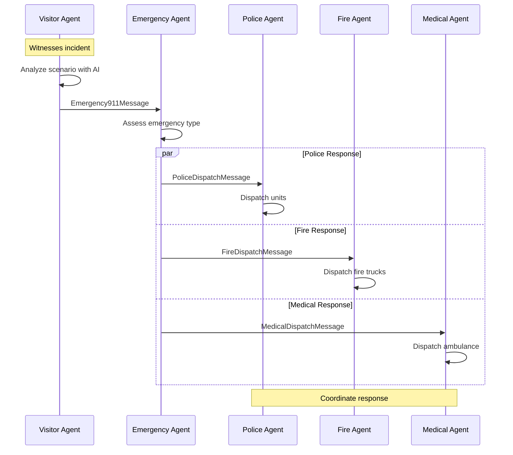

# AI Agents with SmartMessage: Intelligent Communication Patterns

## Overview

AI agents represent the next evolution in distributed systems - intelligent entities that can make contextual decisions, adapt to scenarios, and communicate using natural language understanding. SmartMessage provides the perfect foundation for AI agent communication by offering structured, validated, and discoverable message types that agents can dynamically select and use based on context.

## Agent Communication Paradigms

### Traditional Service Communication
```ruby
# Fixed, hardcoded messaging
order_service.send_inventory_check(product_id: "123")
payment_service.process_payment(amount: 100)
```

### AI Agent Communication
```ruby
# Dynamic, contextual messaging
agent.observe("Customer wants to buy expensive item")
# Agent discovers available message types
# AI selects appropriate message class 
# AI generates contextually relevant properties
# Message is validated and published
```

## Architecture Patterns

### 1. Agent99 Pattern - Request/Response Agents

Agent99 provides a mature framework for building request/response agents that communicate through message brokers:

```ruby
class IntelligentOrderAgent < Agent99::Base
  def info
    {
      name: 'intelligent_order_agent',
      type: :hybrid,
      capabilities: ['order_processing', 'inventory_check', 'payment_processing'],
      request_schema: OrderRequest.schema
    }
  end

  def process_request(payload)
    # AI analyzes the request context
    scenario = extract_scenario(payload)
    
    # Use SmartMessage AI pattern to communicate with other services
    inventory_response = communicate_intelligently(scenario[:inventory_check])
    payment_response = communicate_intelligently(scenario[:payment_request])
    
    # Process results and respond
    send_response(compile_order_result(inventory_response, payment_response))
  end

  private

  def communicate_intelligently(scenario)
    smart_agent = SmartMessageAgent.new("order_agent_#{id}")
    smart_agent.send_message_for_scenario(scenario)
  end
end
```

**Key Characteristics:**
- **Centralized Registry**: Agents register capabilities and discover each other
- **Structured Communication**: Request/response with defined schemas
- **Service-Oriented**: Each agent provides specific business capabilities
- **Message Broker**: AMQP or NATS for reliable delivery

### 2. SmartMessage AI Agent Pattern - Context-Aware Messaging

The SmartMessage AI pattern enables agents to dynamically discover and use appropriate message types:

```ruby
class EmergencyResponseAgent < AgentSupport
  def initialize
    super('emergency_response')
  end

  # Only use emergency-related messages
  def include_message_class?(message_class)
    message_class.to_s.match?(/Emergency|Alert|911|Fire|Medical|Police/)
  end

  def respond_to_incident(incident_report)
    # AI analyzes incident and selects appropriate message type
    scenario = {
      type: determine_emergency_type(incident_report),
      description: incident_report[:description],
      context: incident_report[:context],
      severity: assess_severity(incident_report)
    }

    message = send_message_for_scenario(scenario)
    coordinate_response(message)
  end
end
```

**Key Characteristics:**
- **Dynamic Discovery**: Runtime introspection of available messages  
- **AI Selection**: LLM chooses contextually appropriate message types
- **Intelligent Population**: AI generates valid property values
- **Self-Healing**: Validation retry with AI assistance

### 3. Hybrid Pattern - Agent99 + SmartMessage AI

Combining both patterns creates sophisticated agents that can both serve requests and intelligently communicate:

```ruby
class IntelligentCityAgent < Agent99::Base
  def initialize
    super
    @smart_messenger = AgentSupport.new("city_agent_#{id}")
  end

  def info
    {
      name: 'intelligent_city_agent',
      type: :hybrid,
      capabilities: ['city_monitoring', 'emergency_response', 'traffic_management'],
      request_schema: CityRequest.schema
    }
  end

  # Handle incoming requests (Agent99 pattern)
  def process_request(payload)
    case payload[:action]
    when 'monitor_traffic'
      monitor_traffic_and_report
    when 'emergency_response'
      coordinate_emergency_response(payload[:incident])
    when 'city_status'
      generate_city_status_report
    end
  end

  private

  # Use SmartMessage AI for outgoing communications
  def monitor_traffic_and_report
    traffic_data = collect_traffic_data
    
    if traffic_data[:congestion] > 0.8
      scenario = {
        type: 'traffic_alert',
        description: 'Heavy traffic congestion detected',
        context: "Congestion level: #{traffic_data[:congestion]}, affected routes: #{traffic_data[:routes]}"
      }
      
      @smart_messenger.send_message_for_scenario(scenario)
    end
    
    send_response({ status: 'traffic_monitored', data: traffic_data })
  end

  def coordinate_emergency_response(incident)
    # Use AI to determine appropriate emergency protocols
    scenario = {
      type: 'emergency_coordination',
      description: incident[:description],
      context: incident[:full_context],
      resources_needed: assess_required_resources(incident)
    }

    response_message = @smart_messenger.send_message_for_scenario(scenario)
    track_emergency_response(incident, response_message)
    
    send_response({ 
      status: 'emergency_coordination_initiated',
      response_id: response_message.id 
    })
  end
end
```

## Communication Flows

### Agent Discovery and Registration



### Intelligent Message Exchange



### Multi-Agent Coordination



## AI Agent Communication Patterns

### 1. Contextual Message Selection

```ruby
class IntelligentVisitor < AgentSupport
  def observe_city_event(observation)
    # AI analyzes observation context
    scenario = {
      type: classify_event_type(observation),
      description: observation[:what_happened],
      context: build_full_context(observation),
      urgency: assess_urgency(observation),
      location: observation[:where]
    }

    # AI selects from available emergency message types
    # Could choose: Emergency911Message, SilentAlarmMessage, 
    # FireAlertMessage, MedicalEmergencyMessage, etc.
    message = send_message_for_scenario(scenario)
    
    log_observation(observation, message)
  end

  def classify_event_type(observation)
    # Use AI to classify the event
    prompt = "Classify this observation: #{observation[:description]}"
    response = @llm.ask(prompt)
    extract_classification(response.content)
  end
end
```

### 2. Multi-Modal Intelligence

```ruby
class VisionAgent < AgentSupport
  def process_camera_feed(image_data)
    # Analyze image with AI
    visual_analysis = analyze_image(image_data)
    
    # Convert visual analysis to scenario
    scenario = {
      type: 'visual_detection',
      description: visual_analysis[:description],
      context: visual_analysis[:detailed_context],
      confidence: visual_analysis[:confidence],
      objects_detected: visual_analysis[:objects]
    }

    # Select appropriate message based on what was seen
    if visual_analysis[:emergency_detected]
      send_message_for_scenario(scenario.merge(type: 'emergency'))
    elsif visual_analysis[:suspicious_activity]
      send_message_for_scenario(scenario.merge(type: 'security_alert'))
    else
      send_message_for_scenario(scenario.merge(type: 'routine_observation'))
    end
  end
end
```

### 3. Learning and Adaptation

```ruby
class LearningAgent < AgentSupport
  def initialize(name)
    super(name)
    @message_history = []
    @success_patterns = {}
  end

  def send_message_for_scenario(scenario)
    message = super(scenario)
    
    # Track message attempts
    @message_history << {
      scenario: scenario,
      message_class: message.class,
      timestamp: Time.now,
      success: message.published?
    }

    # Learn from successful patterns
    if message.published?
      pattern_key = "#{scenario[:type]}_#{message.class}"
      @success_patterns[pattern_key] = (@success_patterns[pattern_key] || 0) + 1
    end

    message
  end

  # Override selection to use learned patterns
  def fallback_select_message(available_messages, scenario)
    # Check if we have successful patterns for this scenario type
    successful_classes = @success_patterns
      .select { |key, _| key.start_with?("#{scenario[:type]}_") }
      .sort_by { |_, count| -count }
      .map { |key, _| key.split('_', 2).last }

    # Try most successful class first
    successful_classes.each do |class_name|
      if available_messages[class_name]
        logger.info("Using learned pattern: #{class_name} for #{scenario[:type]}")
        return available_messages[class_name][:class]
      end
    end

    # Fall back to parent logic
    super
  end
end
```

## Integration Strategies

### 1. Agent99 as Service Layer + SmartMessage as Communication Layer

```ruby
# Service registration and discovery through Agent99
class OrderProcessingService < Agent99::Base
  def initialize
    super
    @payment_communicator = PaymentAgent.new
    @inventory_communicator = InventoryAgent.new
  end

  def info
    {
      name: 'order_processing_service',
      type: :server,
      capabilities: ['order_processing', 'order_validation', 'order_fulfillment']
    }
  end

  def process_request(order_data)
    # Use SmartMessage AI agents for intelligent communication
    inventory_result = @inventory_communicator.check_availability(order_data[:items])
    payment_result = @payment_communicator.process_payment(order_data[:payment])
    
    # Return structured response
    send_response({
      order_id: generate_order_id,
      status: determine_order_status(inventory_result, payment_result),
      inventory: inventory_result,
      payment: payment_result
    })
  end
end

# Communication agents using SmartMessage AI
class PaymentAgent < AgentSupport
  def process_payment(payment_data)
    scenario = {
      type: 'payment_processing',
      description: "Process payment of $#{payment_data[:amount]}",
      context: payment_data.to_json,
      amount: payment_data[:amount],
      method: payment_data[:method]
    }

    send_message_for_scenario(scenario)
  end
end
```

### 2. Unified Agent Framework

```ruby
class UnifiedIntelligentAgent
  include Agent99::Base         # For service capabilities
  include AgentSupport         # For intelligent messaging

  def initialize(name, capabilities)
    @name = name
    @capabilities = capabilities
    @agent99 = Agent99::Base.new
    @smart_messenger = AgentSupport.new(name)
  end

  # Agent99 interface for service discovery
  def info
    {
      name: @name,
      type: :hybrid,
      capabilities: @capabilities,
      ai_enabled: true
    }
  end

  # Handle incoming service requests
  def process_request(payload)
    # Use AI to understand request intent
    intent = analyze_request_intent(payload)
    
    # Route to appropriate handler
    case intent[:category]
    when 'data_request'
      handle_data_request(intent, payload)
    when 'action_request'  
      handle_action_request(intent, payload)
    when 'coordination_request'
      handle_coordination_request(intent, payload)
    end
  end

  # Use SmartMessage AI for outgoing communications
  def communicate_with_context(scenario)
    @smart_messenger.send_message_for_scenario(scenario)
  end

  private

  def analyze_request_intent(payload)
    prompt = "Analyze this agent request and categorize: #{payload.to_json}"
    response = @smart_messenger.llm.ask(prompt)
    parse_intent(response.content)
  end
end
```

## Advanced Patterns

### 1. Agent Swarms with Collective Intelligence

```ruby
class SwarmCoordinator < AgentSupport
  def initialize
    super('swarm_coordinator')
    @swarm_members = []
    @collective_knowledge = {}
  end

  def add_swarm_member(agent)
    @swarm_members << agent
    share_knowledge_with_member(agent)
  end

  def coordinate_swarm_response(scenario)
    # Distribute scenario analysis across swarm
    member_analyses = @swarm_members.map do |member|
      Thread.new { member.analyze_scenario(scenario) }
    end.map(&:value)

    # Aggregate insights
    collective_analysis = aggregate_member_analyses(member_analyses)
    
    # Each member sends messages based on collective intelligence
    @swarm_members.each do |member|
      member_scenario = customize_scenario_for_member(scenario, collective_analysis, member)
      member.send_message_for_scenario(member_scenario)
    end
  end
end
```

### 2. Cross-Domain Agent Bridges

```ruby
class CrossDomainBridge < AgentSupport
  def initialize(source_domain, target_domain)
    super("bridge_#{source_domain}_to_#{target_domain}")
    @source_domain = source_domain
    @target_domain = target_domain
    @domain_translators = setup_domain_translators
  end

  def bridge_message(source_message, target_agents)
    # Translate message between domains
    translation_context = {
      source_domain: @source_domain,
      target_domain: @target_domain,
      message: source_message.to_h
    }

    translated_scenarios = @domain_translators.map do |translator|
      translator.translate(translation_context)
    end

    # Send translated messages to target domain agents
    target_agents.each do |agent|
      translated_scenarios.each do |scenario|
        agent.send_message_for_scenario(scenario)
      end
    end
  end
end
```

### 3. Self-Organizing Agent Networks

```ruby
class SelfOrganizingAgent < AgentSupport
  def initialize(name)
    super(name)
    @network_topology = {}
    @performance_metrics = {}
    @adaptation_threshold = 0.1
  end

  def send_message_for_scenario(scenario)
    # Standard message sending
    message = super(scenario)
    
    # Analyze message performance
    analyze_message_performance(scenario, message)
    
    # Adapt network topology if needed
    adapt_network_topology if adaptation_needed?
    
    message
  end

  private

  def analyze_message_performance(scenario, message)
    performance = {
      delivery_success: message.delivered?,
      response_time: message.response_time,
      recipient_satisfaction: assess_recipient_satisfaction(message)
    }
    
    @performance_metrics[scenario[:type]] = performance
  end

  def adaptation_needed?
    recent_performance = @performance_metrics.values.last(10)
    return false if recent_performance.size < 5
    
    average_success = recent_performance.sum { |p| p[:delivery_success] ? 1 : 0 } / recent_performance.size.to_f
    average_success < @adaptation_threshold
  end

  def adapt_network_topology
    # Use AI to reorganize network connections
    scenario = {
      type: 'network_adaptation',
      description: 'Reorganize agent network for better performance',
      context: @performance_metrics.to_json,
      current_topology: @network_topology
    }

    adaptation_plan = send_message_for_scenario(scenario)
    implement_adaptation_plan(adaptation_plan)
  end
end
```

## Benefits of AI Agent + SmartMessage Integration

### 1. Dynamic Adaptability
- Agents discover new message types without code changes
- AI selects contextually appropriate messages
- System adapts to changing communication patterns

### 2. Intelligent Validation Recovery
- AI fixes validation errors automatically  
- Learns from validation patterns
- Reduces manual intervention

### 3. Semantic Understanding
- AI understands message intent and context
- Enables natural language to structured message translation
- Supports cross-domain communication

### 4. Self-Healing Communication
- Automatic retry with corrections
- Route adaptation based on performance
- Graceful degradation when AI unavailable

### 5. Emergent Behaviors
- Agent swarms with collective intelligence
- Self-organizing network topologies
- Cross-domain message translation

## Real-World Applications

### 1. Smart City Management
```ruby
# Multiple intelligent agents coordinate city operations
traffic_agent = TrafficManagementAgent.new
emergency_agent = EmergencyResponseAgent.new
infrastructure_agent = InfrastructureMonitoringAgent.new

# Visitor reports incident - triggers agent coordination
visitor.observe("Building fire with people trapped")
# → Emergency911Message → EmergencyResponseAgent
# → FireDispatchMessage → Fire Department
# → TrafficControlMessage → Traffic Management  
# → InfrastructureAlertMessage → Infrastructure Team
```

### 2. Autonomous Supply Chain
```ruby
# AI agents manage supply chain dynamically
supplier_agent = SupplierAgent.new
inventory_agent = InventoryAgent.new
logistics_agent = LogisticsAgent.new

# Supply shortage triggers intelligent coordination
inventory_agent.detect_low_stock(product: "widgets")
# → SupplyRequestMessage → Multiple suppliers
# → LogisticsCoordinationMessage → Shipping optimization
# → ProductionPlanningMessage → Manufacturing adjustment
```

### 3. Healthcare Coordination System
```ruby
# Medical AI agents coordinate patient care
diagnostic_agent = DiagnosticAgent.new
treatment_agent = TreatmentAgent.new
pharmacy_agent = PharmacyAgent.new

# Patient symptoms trigger coordinated response
diagnostic_agent.analyze_symptoms(patient_data)
# → DiagnosticRequestMessage → Specialists
# → TreatmentPlanMessage → Treatment providers
# → PrescriptionMessage → Pharmacy systems
```

## Implementation Roadmap

### Phase 1: Basic AI Message Selection
- Integrate Agent99 with SmartMessage AI agent pattern
- Implement message discovery and AI selection
- Basic validation retry logic

### Phase 2: Learning and Adaptation  
- Add message performance tracking
- Implement learning from successful patterns
- Self-adapting agent behavior

### Phase 3: Swarm Intelligence
- Multi-agent coordination protocols
- Collective decision making
- Distributed knowledge sharing

### Phase 4: Cross-Domain Integration
- Domain translation capabilities
- Semantic message bridges
- Universal agent communication protocols

### Phase 5: Self-Organizing Networks
- Dynamic topology adaptation
- Performance-driven restructuring
- Emergent communication patterns

## Model Context Protocol (MCP) Integration

### MCP vs SmartMessage+Agent99: Complementary Technologies

The Model Context Protocol (MCP) and SmartMessage+Agent99 address different but highly complementary aspects of AI agent systems:

**MCP Focus**: Context and resource sharing for AI applications
- **Client-Server Model**: AI hosts connect to resource/tool servers
- **Resource Discovery**: Dynamic access to data sources, files, APIs
- **Tool Execution**: Standardized tool invocation for AI assistants
- **Context Enhancement**: Rich contextual data for AI decision-making

**SmartMessage+Agent99 Focus**: Agent communication and coordination
- **Peer-to-Peer Messaging**: Structured communication between autonomous agents
- **Service Discovery**: Agents finding and coordinating with other agents  
- **Business Logic**: Domain-specific message types with validation
- **Distributed Networks**: Multi-agent coordination across systems

### Synergistic Integration Architecture

```ruby
class MCPEnabledSmartAgent < AgentSupport
  def initialize(name, mcp_servers = [])
    super(name)
    @mcp_clients = setup_mcp_connections(mcp_servers)
    @context_cache = {}
  end

  # Enhanced message generation using MCP context
  def send_message_for_scenario(scenario)
    # Step 1: Gather relevant context via MCP
    mcp_context = gather_contextual_resources(scenario)
    
    # Step 2: Enhance scenario with rich context
    enhanced_scenario = scenario.merge({
      mcp_resources: mcp_context[:resources],
      available_tools: mcp_context[:tools],
      contextual_data: mcp_context[:data]
    })
    
    # Step 3: Use AI with enhanced context for message selection
    super(enhanced_scenario)
  end

  private

  def gather_contextual_resources(scenario)
    context = { resources: [], tools: [], data: {} }
    
    @mcp_clients.each do |server_name, client|
      # Query each MCP server for relevant resources
      resources = client.list_resources(filter: scenario[:type])
      
      relevant_resources = resources.select do |resource|
        resource_relevant_to_scenario?(resource, scenario)
      end
      
      relevant_resources.each do |resource|
        content = client.read_resource(resource[:uri])
        context[:resources] << {
          server: server_name,
          uri: resource[:uri],
          content: content,
          type: resource[:mimeType]
        }
      end
      
      # Gather available tools
      tools = client.list_tools
      context[:tools].concat(tools.map { |tool| { server: server_name, **tool } })
    end
    
    context
  end

  def resource_relevant_to_scenario?(resource, scenario)
    # Use AI to determine resource relevance
    prompt = "Is this resource relevant to scenario '#{scenario[:description]}'? Resource: #{resource[:name]} - #{resource[:description]}"
    response = @llm.ask(prompt)
    response.content.downcase.include?('yes')
  end
end
```

### MCP-Enhanced Message Types

```ruby
# SmartMessage types that leverage MCP resources
class MCPResourceRequest < SmartMessage::Base
  property :resource_uri, required: true
  property :requesting_agent, required: true
  property :use_case, required: true
  property :priority, type: String, default: 'normal'
  
  description "Request access to MCP resources across agent network"
end

class MCPToolInvocation < SmartMessage::Base
  property :tool_name, required: true
  property :server_id, required: true
  property :parameters, type: Hash
  property :callback_agent, required: true
  
  description "Coordinate MCP tool execution across agents"
end

class ContextEnrichedEmergency < SmartMessage::Base
  property :incident_type, required: true
  property :location, required: true
  property :description, required: true
  property :mcp_context, type: Hash
  property :severity_assessment, type: String
  property :recommended_resources, type: Array
  
  description "Emergency message enhanced with MCP contextual data"
end
```

### Hybrid Architecture: Agent99 + SmartMessage + MCP

```ruby
class HybridIntelligentAgent < Agent99::Base
  include AgentSupport  # SmartMessage AI capabilities
  
  def initialize(name, config = {})
    super()
    @smart_messenger = MCPEnabledSmartAgent.new(name, config[:mcp_servers])
    @capabilities = merge_all_capabilities
  end

  def info
    {
      name: @name,
      type: :hybrid,
      capabilities: @capabilities,
      mcp_enabled: true,
      smart_message_enabled: true,
      ai_enhanced: true
    }
  end

  # Process Agent99 requests with MCP context + SmartMessage intelligence
  def process_request(payload)
    # Create scenario from Agent99 request
    scenario = {
      type: determine_scenario_type(payload),
      description: payload[:description],
      context: payload,
      agent_request: true
    }
    
    # Use MCP-enhanced SmartMessage for intelligent processing
    response_message = @smart_messenger.send_message_for_scenario(scenario)
    
    # Return structured Agent99 response
    send_response({
      result: response_message.to_h,
      intelligence_sources: ['mcp_context', 'ai_selection', 'smart_message'],
      enhanced: true
    })
  end

  private

  def merge_all_capabilities
    agent99_caps = super || []
    smart_message_caps = @smart_messenger.discover_message_types.keys
    mcp_caps = @smart_messenger.mcp_clients.flat_map { |_, client| client.list_tools.map { |t| t[:name] } }
    
    {
      agent99: agent99_caps,
      smart_message: smart_message_caps,
      mcp_tools: mcp_caps
    }
  end
end
```

### Real-World Integration: Smart City with MCP

```ruby
class SmartCityMCPCoordinator < HybridIntelligentAgent
  def initialize
    mcp_servers = {
      traffic_data: { url: 'mcp://city.gov/traffic', capabilities: ['traffic_flow', 'incidents'] },
      weather_service: { url: 'mcp://weather.gov/api', capabilities: ['current', 'forecast'] },
      emergency_db: { url: 'mcp://emergency.city/db', capabilities: ['history', 'resources'] },
      camera_network: { url: 'mcp://security.city/cameras', capabilities: ['live_feed', 'analytics'] },
      social_media: { url: 'mcp://social.monitor/feeds', capabilities: ['sentiment', 'reports'] }
    }
    
    super('smart_city_coordinator', { mcp_servers: mcp_servers })
  end

  def process_citywide_incident(incident_report)
    # Scenario incorporates all available context sources
    scenario = {
      type: 'citywide_emergency',
      description: incident_report[:description],
      location: incident_report[:location],
      severity: incident_report[:initial_severity],
      context: build_comprehensive_context(incident_report)
    }

    # AI processes with full contextual awareness
    coordinated_response = @smart_messenger.send_message_for_scenario(scenario)
    
    # Execute coordinated multi-agent response
    execute_coordinated_response(coordinated_response, scenario[:context])
  end

  private

  def build_comprehensive_context(incident)
    {
      traffic: get_mcp_resource('traffic_data', "current/#{incident[:location]}"),
      weather: get_mcp_resource('weather_service', "conditions/#{incident[:location]}"),
      history: get_mcp_resource('emergency_db', build_history_query(incident)),
      visual: invoke_mcp_tool('camera_network', 'get_area_feed', { location: incident[:location] }),
      social: get_mcp_resource('social_media', "sentiment/#{incident[:location]}/#{Time.now.hour}"),
      resources: get_mcp_resource('emergency_db', "available_resources/#{incident[:location]}")
    }
  end
end
```

### MCP Integration Benefits

1. **Rich Contextual Awareness**: Agents access comprehensive data sources
2. **Dynamic Tool Access**: Agents can invoke external tools through MCP
3. **Enhanced Decision Making**: AI decisions informed by real-world data
4. **Resource Coordination**: Agents coordinate access to shared resources
5. **Cross-Domain Integration**: Bridge different data systems and APIs

### Implementation Strategy

**Phase 1**: Basic MCP Integration
- Connect SmartMessage agents to MCP servers
- Enhance message generation with MCP context
- Implement resource sharing coordination

**Phase 2**: Advanced Context Processing  
- AI-driven resource relevance assessment
- Dynamic tool selection and invocation
- Context caching and optimization

**Phase 3**: Network-Scale Coordination
- MCP resource sharing across agent networks
- Distributed context aggregation
- Intelligent resource allocation

**Phase 4**: Emergent Intelligence
- Agents learning optimal resource usage patterns
- Self-organizing context networks
- Predictive resource provisioning

## Conclusion: The Future of Intelligent Agent Systems

The integration of MCP with SmartMessage+Agent99 creates a comprehensive ecosystem where agents have rich contextual awareness (MCP), intelligent communication (SmartMessage), and seamless coordination (Agent99) - enabling truly intelligent distributed systems that can access any data source, communicate with any agent, and coordinate complex real-world operations.

### The Three-Layer Intelligence Stack

This architecture represents a fundamental shift from traditional microservices to truly intelligent agent networks:

**Layer 1: Context Layer (MCP)**
- Rich data sources and tool access
- Real-time information gathering
- Dynamic resource discovery

**Layer 2: Intelligence Layer (AI + SmartMessage)**  
- Contextual message selection
- Intelligent property generation
- Self-healing validation and adaptation

**Layer 3: Coordination Layer (Agent99)**
- Service discovery and registration  
- Request/response orchestration
- Multi-agent workflow management

### Key Innovations

1. **Context-Aware Messaging**: Messages are selected and populated based on comprehensive real-world context
2. **Dynamic Adaptability**: Agents adapt to new message types and changing scenarios without code changes
3. **Self-Healing Networks**: Automatic error recovery and network topology optimization
4. **Emergent Intelligence**: Collective agent behaviors that exceed individual capabilities
5. **Cross-Domain Bridge**: Seamless communication across different domains and protocols

### Competitive Advantages

**vs Traditional Microservices**: Intelligent, adaptive communication vs fixed API contracts
**vs Simple AI Agents**: Structured, validated messaging vs unstructured interactions  
**vs MCP Alone**: Multi-agent coordination vs single client-server interactions
**vs Message Queues**: AI-driven routing vs static queue management

### Real-World Impact

This architecture enables:
- **Smart Cities** that respond intelligently to emerging situations
- **Autonomous Supply Chains** that adapt to disruptions dynamically
- **Healthcare Systems** that coordinate patient care seamlessly
- **Financial Networks** that detect and respond to market changes
- **IoT Ecosystems** that self-organize and optimize operations

### The Path Forward

The convergence of MCP resource sharing, SmartMessage structured communication, and Agent99 service coordination—all enhanced by AI intelligence—represents the next generation of distributed systems architecture. These aren't competing technologies but synergistic protocols that together enable the creation of truly intelligent, adaptive, and autonomous software ecosystems.

**This is the future of software: not just connected systems, but intelligent networks of autonomous agents that understand context, communicate naturally, and coordinate seamlessly to solve complex real-world problems.**